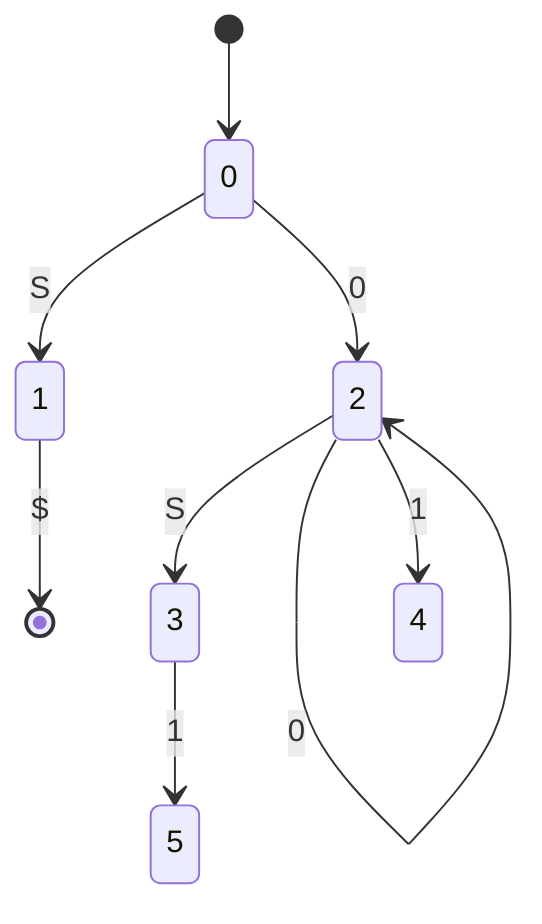
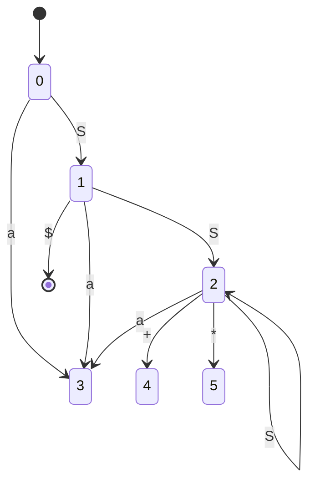
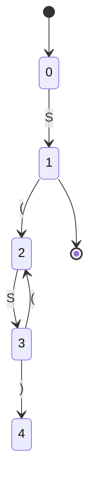

# Exercises 4.6

## Problem 1

### Problem Description

Describe all the viable prefixes for the following grammars:

a) The grammar $S\rightarrow 0S1\;|\;01$ of Exercise 4.2.2(a).

b) The grammar $S\rightarrow SS+\;|\;SS*\;|\;a$ of Exercise 4.2.1.

c) The grammar $S\rightarrow S(S)\;|\;\epsilon$ of Exercise 4.2.2(c).

### Solution

#### a)

First, the augmented grammar is
$$
S'\rightarrow S\\
S\rightarrow 0S1\;|\;01
$$

We can build such a GOTO table:

|                                                              | $S$                      | $0$                                                          | $1$                     | Finished |
| ------------------------------------------------------------ | ------------------------ | ------------------------------------------------------------ | ----------------------- | -------- |
| $S'\rightarrow\cdot S\\S\rightarrow\cdot 0S1\\ S\rightarrow\cdot 01$ | $S'\rightarrow S\cdot$   | $S\rightarrow0\cdot S1\\S\rightarrow0\cdot 1\\S\rightarrow\cdot 0S1\\S\rightarrow\cdot 01$ | $\varnothing$           | F        |
|                                                              |                          |                                                              |                         |          |
| $S'\rightarrow S\cdot$                                       | $\varnothing$            | $\varnothing$                                                | $\varnothing$           | T        |
|                                                              |                          |                                                              |                         |          |
| $S\rightarrow0\cdot S1\\S\rightarrow0\cdot 1\\S\rightarrow\cdot 0S1\\S\rightarrow\cdot 01$ | $S\rightarrow 0S\cdot 1$ | $$S\rightarrow0\cdot S1\\S\rightarrow0\cdot 1\\S\rightarrow\cdot 0S1\\S\rightarrow\cdot 01$$ | $S\rightarrow 01\cdot$  | F        |
|                                                              |                          |                                                              |                         |          |
| $S\rightarrow 0S\cdot 1$                                     | $\varnothing$            | $\varnothing$                                                | $S\rightarrow 0S1\cdot$ | F        |
|                                                              |                          |                                                              |                         |          |
| $S\rightarrow 01\cdot$                                       | $\varnothing$            | $\varnothing$                                                | $\varnothing$           | F        |
|                                                              |                          |                                                              |                         |          |
| $S\rightarrow 0S1\cdot$                                      | $\varnothing$            | $\varnothing$                                                | $\varnothing$           | F        |

Then, we rewrite the form as follows

|       | $S$   | $0$   | $1$   | Finished |
| ----- | ----- | ----- | ----- | -------- |
| $S_0$ | $S_1$ | $S_2$ |       | F        |
| $S_1$ |       |       |       | T        |
| $S_2$ | $S_3$ | $S_2$ | $S_4$ | F        |
| $S_3$ |       |       | $S_5$ | F        |
| $S_4$ |       |       |       | F        |
| $S_5$ |       |       |       | F        |

And then

The viable prefix contains all the paths in this diagram except $S$ itself.

#### b)

First, the augmented grammar is
$$
S'\rightarrow S\\
S\rightarrow SS+\;|\;SS*\;|\;a
$$

We can build such a GOTO table:

|                                                              | $S$                                                          | $+$                     | $*$                     | $a$                   | FINISHED |
| ------------------------------------------------------------ | ------------------------------------------------------------ | ----------------------- | ----------------------- | --------------------- | -------- |
| $S'\rightarrow\cdot S\\S\rightarrow \cdot SS+\\S\rightarrow \cdot SS*\\S\rightarrow \cdot a$ | $S'\rightarrow S\cdot\\S\rightarrow S\cdot S+\\S\rightarrow S\cdot S*\\S\rightarrow\cdot SS+\\S\rightarrow\cdot SS*\\S\rightarrow\cdot a$ | $\varnothing$           | $\varnothing$           | $S\rightarrow a\cdot$ | F        |
|                                                              |                                                              |                         |                         |                       |          |
| $S'\rightarrow S\cdot\\S\rightarrow S\cdot S+\\S\rightarrow S\cdot S*\\S\rightarrow\cdot SS+\\S\rightarrow\cdot SS*\\S\rightarrow\cdot a$ | $S\rightarrow SS\cdot+\\S\rightarrow SS\cdot*\\S\rightarrow S\cdot S+\\S\rightarrow S\cdot S*\\S\rightarrow\cdot SS+\\S\rightarrow\cdot SS*\\S\rightarrow\cdot a$ | $\varnothing$           | $\varnothing$           | $S\rightarrow a\cdot$ | T        |
|                                                              |                                                              |                         |                         |                       |          |
| $S\rightarrow SS\cdot+\\S\rightarrow SS\cdot*\\S\rightarrow S\cdot S+\\S\rightarrow S\cdot S*\\S\rightarrow\cdot SS+\\S\rightarrow\cdot SS*\\S\rightarrow\cdot a$ | $S\rightarrow SS\cdot+\\S\rightarrow SS\cdot*\\S\rightarrow S\cdot S+\\S\rightarrow S\cdot S*\\S\rightarrow\cdot SS+\\S\rightarrow\cdot SS*\\S\rightarrow\cdot a$ | $S\rightarrow SS+\cdot$ | $S\rightarrow SS*\cdot$ | $S\rightarrow a\cdot$ | F        |
|                                                              |                                                              |                         |                         |                       |          |
| $S\rightarrow a\cdot$                                        | $\varnothing$                                                | $\varnothing$           | $\varnothing$           | $\varnothing$         | F        |
|                                                              |                                                              |                         |                         |                       |          |
| $S\rightarrow SS+\cdot$                                      | $\varnothing$                                                | $\varnothing$           | $\varnothing$           | $\varnothing$         | F        |
|                                                              |                                                              |                         |                         |                       |          |
| $S\rightarrow SS*\cdot$                                      | $\varnothing$                                                | $\varnothing$           | $\varnothing$           | $\varnothing$         | F        |

Then, we rewrite the form as follows

|       | $S$   | +     | $*$   | $a$   | FINISHED |
| ----- | ----- | ----- | ----- | ----- | -------- |
| $S_0$ | $S_1$ |       |       | $S_3$ | F        |
| $S_1$ | $S_2$ |       |       | $S_3$ | T        |
| $S_2$ | $S_2$ | $S_4$ | $S_5$ | $S_3$ | F        |
| $S_3$ |       |       |       |       | F        |
| $S_4$ |       |       |       |       | F        |
| $S_5$ |       |       |       |       | F        |

And then

The viable prefix contains all the paths in this diagram except $S$ itself.

#### c)

The augmented grammar is
$$
S'\rightarrow S\\
S\rightarrow S(S)\;|\;\epsilon
$$
We can build such a GOTO table:

|                                                              | $S$                                              | $($                                                          | $)$                      | FINISHED |
| ------------------------------------------------------------ | ------------------------------------------------ | ------------------------------------------------------------ | ------------------------ | -------- |
| $S'\rightarrow\cdot S\\S\rightarrow \cdot S(S)\\S\rightarrow \cdot$ | $S'\rightarrow S\cdot\\S\rightarrow S\cdot(S)$   | $\varnothing$                                                | $\varnothing$            | F        |
|                                                              |                                                  |                                                              |                          |          |
| $S'\rightarrow S\cdot\\S\rightarrow S\cdot(S)$               | $\varnothing$                                    | $S\rightarrow S(\cdot S)\\S\rightarrow \cdot S(S)\\S\rightarrow \cdot$ | $\varnothing$            | T        |
|                                                              |                                                  |                                                              |                          |          |
| $S\rightarrow S(\cdot S)\\S\rightarrow \cdot S(S)\\S\rightarrow \cdot$ | $S\rightarrow S(S\cdot)\\S\rightarrow S\cdot(S)$ | $\varnothing$                                                | $\varnothing$            | F        |
|                                                              |                                                  |                                                              |                          |          |
| $S\rightarrow S(S\cdot)\\S\rightarrow S\cdot(S)$             | $\varnothing$                                    | $S\rightarrow S(\cdot S)\\S\rightarrow \cdot S(S)\\S\rightarrow \cdot$ | $S\rightarrow S(S)\cdot$ | F        |
|                                                              |                                                  |                                                              |                          |          |
| $S\rightarrow S(S)\cdot$                                     | $\varnothing$                                    | $\varnothing$                                                | $\varnothing$            | F        |

We can rewrite the form as follow:

|       | $S$   | $($   | $)$   | FINISHED |
| ----- | ----- | ----- | ----- | -------- |
| $S_0$ | $S_1$ |       |       | F        |
| $S_1$ |       | $S_2$ |       | T        |
| $S_2$ | $S_3$ |       |       | F        |
| $S_3$ |       | $S_2$ | $S_4$ | F        |
| $S_4$ |       |       |       | F        |

And then

The viable prefix contains all the paths in this diagram except $S$ itself.

## Problem 2

### Problem Description

Construct the SLR sets of items for the (augmented) grammar of Exercise 4.2.1. Compute the GOTO function for these sets of items. Show the parsing table for this grammar. Is the grammar SLR?

### Solution

The sets of items and GOTO function have been done in Problem 1.

Let r1 represents $S\rightarrow SS+\cdot$, r2 represents $S\rightarrow SS*\cdot$ and r3 represents $S\rightarrow a\cdot$.

#### Initialize

Initialize ACTION table as follow:

|       | +    | $*$  | $a$  | \$     |
| ----- | ---- | ---- | ---- | ------ |
| $S_0$ |      |      | s3   |        |
| $S_1$ |      |      | s3   | accept |
| $S_2$ | s4   | s5   | s3   |        |
| $S_3$ |      |      |      |        |
| $S_4$ |      |      |      |        |
| $S_5$ |      |      |      |        |

#### Extend by FOLLOW

Since $S$ can’t be $\epsilon$, FOLLOW($S$) contains $\{+,*,\$\}$ and FIRST($S$) (See Exercise 4.2), which equals to $\{+,*,a,\$\}$.

By the FOLLOW table in Exercise 4.4. We can extend this table as

|       | +    | $*$  | $a$  | \$     |
| ----- | ---- | ---- | ---- | ------ |
| $S_0$ |      |      | s3   |        |
| $S_1$ |      |      | s3   | accept |
| $S_2$ | s4   | s5   | s3   |        |
| $S_3$ | r3   | r3   | r3   | r3     |
| $S_4$ | r1   | r1   | r1   | r1     |
| $S_5$ | r2   | r2   | r2   | r2     |

Since this table is unambiguous, it is a SLR table.

## Problem 3

### Problem Description

Show the actions of your parsing table from Exercise 4.6.2 on the input $aa*a+$.

### Solution

As shown in the table below:

| Stack            | Input   | Action |
| ---------------- | ------- | ------ |
| $\$S_0$          | $aa*a+$ | s3     |
| $\$S_0 S_3$      | $a*a+$  | r3     |
| $\$S_0S_1$       | $a*a+$  | s3     |
| $\$S_0S_1S_3$    | $*a+$   | r3     |
| $\$S_0S_1S_2$    | $*a+$   | s5     |
| $\$S_0S_1S_2S_5$ | $a+$    | r2     |
| $\$S_0S_1$       | $a+$    | s3     |
| $\$S_0S_1S_3$    | $+$     | r3     |
| $\$S_0S_1S_2$    | $+$     | s4     |
| $\$S_0S_1S_2S_4$ |         | r1     |
| $\$S_0S_1$       |         | accept |

## Problem 4

### Problem Description

For each of the (augmented) grammars of Exercise 4.2.2(a)-(g):

a) Construct the SLR sets of items and their GOTO function.

b) Indicate any action conflicts in your sets of items.

c) Construct the SLR-parsing table, if one exists.

### Solution

#### Grammar a)

##### Build GOTO

The first problem is answered in Problem 1.

##### Build ACTION

Now we initialize the ACTION table with GOTO table:

|       | $0$  | $1$  | $\$$   |
| ----- | ---- | ---- | ------ |
| $S_0$ | s2   |      |        |
| $S_1$ |      |      | accept |
| $S_2$ | s2   | s4   |        |
| $S_3$ |      | s5   |        |
| $S_4$ |      |      |        |
| $S_5$ |      |      |        |

Let r1 represents $S\rightarrow 0S1$ and r2 represents $S\rightarrow 01$. Then we can fill the ACTION table further by FOLLOW(See Exercise 4.4):

|       | $0$  | $1$  | $\$$   |
| ----- | ---- | ---- | ------ |
| $S_0$ | s2   |      |        |
| $S_1$ |      |      | accept |
| $S_2$ | s2   | s4   |        |
| $S_3$ |      | s5   |        |
| $S_4$ |      | r2   | r2     |
| $S_5$ |      | r1   | r1     |

There’s no conflict in ACTION table, and thus combine it and GOTO table will generate the SLR parsing table.

#### Grammar b)

The augmented grammar is
$$
S'\rightarrow S\\
S\rightarrow +SS\;|\;*SS\;|\;a
$$

##### Build GOTO

We can build such a GOTO table:

|                                                              | $S$                                                          | $+$                                                          | $*$                                                          | $a$                   | FINISHED |
| ------------------------------------------------------------ | ------------------------------------------------------------ | ------------------------------------------------------------ | ------------------------------------------------------------ | --------------------- | -------- |
| $S'\rightarrow\cdot S\\S\rightarrow\cdot +SS\\S\rightarrow\cdot*SS\\S\rightarrow\cdot a$ | $S'\rightarrow S\cdot$                                       | $S\rightarrow +\cdot SS\\S\rightarrow\cdot +SS\\S\rightarrow\cdot*SS\\S\rightarrow\cdot a$ | $S\rightarrow *\cdot SS\\S\rightarrow\cdot +SS\\S\rightarrow\cdot*SS\\S\rightarrow\cdot a$ | $S\rightarrow a\cdot$ | F        |
|                                                              |                                                              |                                                              |                                                              |                       |          |
| $S\rightarrow +\cdot SS\\S\rightarrow\cdot +SS\\S\rightarrow\cdot*SS\\S\rightarrow\cdot a$ | $S\rightarrow +S\cdot S\\S\rightarrow\cdot +SS\\S\rightarrow\cdot*SS\\S\rightarrow\cdot a$ | $S\rightarrow +\cdot SS\\S\rightarrow\cdot +SS\\S\rightarrow\cdot*SS\\S\rightarrow\cdot a$ | $S\rightarrow *\cdot SS\\S\rightarrow\cdot +SS\\S\rightarrow\cdot*SS\\S\rightarrow\cdot a$ | $S\rightarrow a\cdot$ | F        |
|                                                              |                                                              |                                                              |                                                              |                       |          |
| $S\rightarrow *\cdot SS\\S\rightarrow\cdot +SS\\S\rightarrow\cdot*SS\\S\rightarrow\cdot a$ | $S\rightarrow *S\cdot S\\S\rightarrow\cdot +SS\\S\rightarrow\cdot*SS\\S\rightarrow\cdot a$ | $S\rightarrow +\cdot SS\\S\rightarrow\cdot +SS\\S\rightarrow\cdot*SS\\S\rightarrow\cdot a$ | $S\rightarrow *\cdot SS\\S\rightarrow\cdot +SS\\S\rightarrow\cdot*SS\\S\rightarrow\cdot a$ | $S\rightarrow a\cdot$ | F        |
|                                                              |                                                              |                                                              |                                                              |                       |          |
| $S\rightarrow +S\cdot S\\S\rightarrow\cdot +SS\\S\rightarrow\cdot*SS\\S\rightarrow\cdot a$ | $S\rightarrow +SS\cdot$                                      | $S\rightarrow +\cdot SS\\S\rightarrow\cdot +SS\\S\rightarrow\cdot*SS\\S\rightarrow\cdot a$ | $S\rightarrow *\cdot SS\\S\rightarrow\cdot +SS\\S\rightarrow\cdot*SS\\S\rightarrow\cdot a$ | $S\rightarrow a\cdot$ | F        |
|                                                              |                                                              |                                                              |                                                              |                       |          |
| $S\rightarrow *S\cdot S\\S\rightarrow\cdot +SS\\S\rightarrow\cdot*SS\\S\rightarrow\cdot a$ | $S\rightarrow *SS\cdot$                                      | $S\rightarrow +\cdot SS\\S\rightarrow\cdot +SS\\S\rightarrow\cdot*SS\\S\rightarrow\cdot a$ | $S\rightarrow *\cdot SS\\S\rightarrow\cdot +SS\\S\rightarrow\cdot*SS\\S\rightarrow\cdot a$ | $S\rightarrow a\cdot$ | F        |
|                                                              |                                                              |                                                              |                                                              |                       |          |
| $S'\rightarrow S\cdot$                                       | $\varnothing$                                                | $\varnothing$                                                | $\varnothing$                                                | $\varnothing$         | T        |
|                                                              |                                                              |                                                              |                                                              |                       |          |
| $S\rightarrow a\cdot$                                        | $\varnothing$                                                | $\varnothing$                                                | $\varnothing$                                                | $\varnothing$         | F        |
|                                                              |                                                              |                                                              |                                                              |                       |          |
| $S\rightarrow +SS\cdot$                                      | $\varnothing$                                                | $\varnothing$                                                | $\varnothing$                                                | $\varnothing$         | F        |
|                                                              |                                                              |                                                              |                                                              |                       |          |
| $S\rightarrow *SS\cdot$                                      | $\varnothing$                                                | $\varnothing$                                                | $\varnothing$                                                | $\varnothing$         | F        |

Then, we rewrite the form as follows

|       | $S$   | $+$   | $*$   | $a$   | FINISHED |
| ----- | ----- | ----- | ----- | ----- | -------- |
| $S_0$ | $S_5$ | $S_1$ | $S_2$ | $S_6$ | F        |
| $S_1$ | $S_3$ | $S_1$ | $S_2$ | $S_6$ | F        |
| $S_2$ | $S_4$ | $S_1$ | $S_2$ | $S_6$ | F        |
| $S_3$ | $S_7$ | $S_1$ | $S_2$ | $S_6$ | F        |
| $S_4$ | $S_8$ | $S_1$ | $S_2$ | $S_6$ | F        |
| $S_5$ |       |       |       |       | T        |
| $S_6$ |       |       |       |       | F        |
| $S_7$ |       |       |       |       | F        |
| $S_8$ |       |       |       |       | F        |

##### Build ACTION

Now we initialize the ACTION table with GOTO table:

|       | $+$  | $*$  | $a$  | \$     |
| ----- | ---- | ---- | ---- | ------ |
| $S_0$ | s1   | s2   | s6   |        |
| $S_1$ | s1   | s2   | s6   |        |
| $S_2$ | s1   | s2   | s6   |        |
| $S_3$ | s1   | s2   | s6   |        |
| $S_4$ | s1   | s2   | s6   |        |
| $S_5$ |      |      |      | accept |
| $S_6$ |      |      |      |        |
| $S_7$ |      |      |      |        |
| $S_8$ |      |      |      |        |

Since $S$ can’t be $\epsilon$. FIRST($S$) contains $\{+,*,a\}$. FOLLOW($S$) contains $\$$ and FIRST($S$), it should be $\{+,*,a,\$\}$.

Let r1 represents $S\rightarrow a\cdot$, r2 represents $S\rightarrow +SS\cdot$ and r3 represents $S\rightarrow *SS\cdot$. Then

|       | $+$  | $*$  | $a$  | \$     |
| ----- | ---- | ---- | ---- | ------ |
| $S_0$ | s1   | s2   | s6   |        |
| $S_1$ | s1   | s2   | s6   |        |
| $S_2$ | s1   | s2   | s6   |        |
| $S_3$ | s1   | s2   | s6   |        |
| $S_4$ | s1   | s2   | s6   |        |
| $S_5$ |      |      |      | accept |
| $S_6$ | r1   | r1   | r1   | r1     |
| $S_7$ | r2   | r2   | r2   | r2     |
| $S_8$ | r3   | r3   | r3   | r3     |

#### Grammar c)

The augmented grammar is
$$
S'\rightarrow S\\
S\rightarrow S(S)S\;|\;\epsilon
$$

##### Build GOTO

We can build such a GOTO table:

|                                                              | $S$                                                | $($                                                          | $)$                                                          | FINISHED |
| ------------------------------------------------------------ | -------------------------------------------------- | ------------------------------------------------------------ | ------------------------------------------------------------ | -------- |
| $S'\rightarrow\cdot S\\S\rightarrow \cdot S(S)S\\S\rightarrow\cdot$ | $S'\rightarrow S\cdot\\S\rightarrow S\cdot(S)S$    | $\varnothing$                                                | $\varnothing$                                                | F        |
|                                                              |                                                    |                                                              |                                                              |          |
| $S'\rightarrow S\cdot\\S\rightarrow S\cdot(S)S$              | $\varnothing$                                      | $S\rightarrow S(\cdot S)S\\S\rightarrow \cdot S(S)S\\S\rightarrow\cdot$ | $\varnothing$                                                | T        |
|                                                              |                                                    |                                                              |                                                              |          |
| $S\rightarrow S(\cdot S)S\\S\rightarrow \cdot S(S)S\\S\rightarrow\cdot$ | $S\rightarrow S(S\cdot)S\\S\rightarrow S\cdot(S)S$ | $\varnothing$                                                | $\varnothing$                                                | F        |
|                                                              |                                                    |                                                              |                                                              |          |
| $S\rightarrow S(S\cdot)S\\S\rightarrow S\cdot(S)S$           | $\varnothing$                                      | $S\rightarrow S(\cdot S)S\\S\rightarrow \cdot S(S)S\\S\rightarrow\cdot$ | $S\rightarrow S(S)\cdot S\\S\rightarrow \cdot S(S)S\\S\rightarrow\cdot$ | F        |
|                                                              |                                                    |                                                              |                                                              |          |
| $S\rightarrow S(S)\cdot S\\S\rightarrow \cdot S(S)S\\S\rightarrow\cdot$ | $S\rightarrow S(S)S\cdot\\S\rightarrow S\cdot(S)S$ | $\varnothing$                                                | $\varnothing$                                                | F        |
|                                                              |                                                    |                                                              |                                                              |          |
| $S\rightarrow S(S)S\cdot\\S\rightarrow S\cdot(S)S$           | $\varnothing$                                      | $S\rightarrow S(\cdot S)S\\S\rightarrow \cdot S(S)S\\S\rightarrow\cdot$ | $\varnothing$                                                | F        |

Then, we rewrite the form as follows

|       | $S$   | $($   | $)$   | FINISHED |
| ----- | ----- | ----- | ----- | -------- |
| $S_0$ | $S_1$ |       |       | F        |
| $S_1$ |       | $S_2$ |       | T        |
| $S_2$ | $S_3$ |       |       | F        |
| $S_3$ |       | $S_2$ | $S_4$ | F        |
| $S_4$ | $S_5$ |       |       | F        |
| $S_5$ |       | $S_2$ |       | F        |

##### Build ACTION

Now we initialize the ACTION table with GOTO table:

|          | $($  | $)$  | \$     |
| -------- | ---- | ---- | ------ |
| $S_0$    |  |  |  |
| $S_1$    | s2   |      | accept |
| $S_2$    |  |  |  |
| $S_3$    | s2   | s4   |        |
| $S_4$    |  |  |        |
| $S_5$    | s2   |      |        |

By observation, FOLLOW($S$) should contain $\{\$,(,)\}$. Represent r1 as $S\rightarrow\cdot$ and r2 as $S\rightarrow S(S)S\cdot$.

|          | $($  | $)$  | \$     |
| -------- | ---- | ---- | ------ |
| $S_0$    | r1 | r1 | r1 |
| $S_1$    | s2   |      | accept |
| $S_2$    | r1 | r1 | r1 |
| $S_3$    | s2   | s4   |        |
| $S_4$    | r1 | r1 | r1 |
| $S_5$    | s2   | r2 | r2 |
|  | r2 | | |

Multiple values in one entry indicate contradictions.

#### Grammar d)

The augment grammar is
$$
S'\rightarrow S\\
S\rightarrow S+S\;|\;SS\;|\;(S)\;|\;S*\;|\;a
$$

##### Build GOTO

We can build such a GOTO table:
|                                                              | $S$                                                          | $+$                                                          | $($                                                          | $)$                     | $*$                    | $a$                   | FINISHED |
| ------------------------------------------------------------ | ------------------------------------------------------------ | ------------------------------------------------------------ | ------------------------------------------------------------ | ----------------------- | ---------------------- | --------------------- | -------- |
| $S'\rightarrow\cdot S\\S\rightarrow \cdot S+S\\S\rightarrow \cdot SS\\S\rightarrow \cdot (S)\\S\rightarrow \cdot S*\\S\rightarrow \cdot a$ | $S'\rightarrow S\cdot\\S\rightarrow S\cdot+S\\S\rightarrow S\cdot S\\S\rightarrow S\cdot*\\S\rightarrow \cdot S+S\\S\rightarrow \cdot SS\\S\rightarrow \cdot (S)\\S\rightarrow \cdot S*\\S\rightarrow \cdot a$ | $\varnothing$                                                | $S\rightarrow(\cdot S)\\S\rightarrow \cdot S+S\\S\rightarrow \cdot SS\\S\rightarrow \cdot (S)\\S\rightarrow \cdot S*\\S\rightarrow \cdot a$ | $\varnothing$           | $\varnothing$          | $S\rightarrow a\cdot$ | F        |
|                                                              |                                                              |                                                              |                                                              |                         |                        |                       |          |
| $S'\rightarrow S\cdot\\S\rightarrow S\cdot+S\\S\rightarrow S\cdot S\\S\rightarrow S\cdot*\\S\rightarrow \cdot S+S\\S\rightarrow \cdot SS\\S\rightarrow \cdot (S)\\S\rightarrow \cdot S*\\S\rightarrow \cdot a$ | $S\rightarrow SS\cdot\\S\rightarrow S\cdot+S\\S\rightarrow S\cdot S\\S\rightarrow S\cdot*\\S\rightarrow \cdot S+S\\S\rightarrow \cdot SS\\S\rightarrow \cdot (S)\\S\rightarrow \cdot S*\\S\rightarrow \cdot a$ | $S\rightarrow S+\cdot S\\S\rightarrow \cdot S+S\\S\rightarrow \cdot SS\\S\rightarrow \cdot (S)\\S\rightarrow \cdot S*\\S\rightarrow \cdot a$ | $S\rightarrow(\cdot S)\\S\rightarrow \cdot S+S\\S\rightarrow \cdot SS\\S\rightarrow \cdot (S)\\S\rightarrow \cdot S*\\S\rightarrow \cdot a$ | $\varnothing$           | $S\rightarrow S*\cdot$ | $S\rightarrow a\cdot$ | T        |
|                                                              |                                                              |                                                              |                                                              |                         |                        |                       |          |
| $S\rightarrow(\cdot S)\\S\rightarrow \cdot S+S\\S\rightarrow \cdot SS\\S\rightarrow \cdot (S)\\S\rightarrow \cdot S*\\S\rightarrow \cdot a$ | $S\rightarrow (S\cdot)\\S\rightarrow S\cdot+S\\S\rightarrow S\cdot S\\S\rightarrow S\cdot*\\S\rightarrow \cdot S+S\\S\rightarrow \cdot SS\\S\rightarrow \cdot (S)\\S\rightarrow \cdot S*\\S\rightarrow \cdot a$ | $\varnothing$                                     | $S\rightarrow(\cdot S)\\S\rightarrow \cdot S+S\\S\rightarrow \cdot SS\\S\rightarrow \cdot (S)\\S\rightarrow \cdot S*\\S\rightarrow \cdot a$ | $\varnothing$           | $\varnothing$          | $S\rightarrow a\cdot$ | F        |
|                                                              |                                                              |                                                              |                                                              |                         |                        |                       |          |
| $S\rightarrow SS\cdot\\S\rightarrow S\cdot+S\\S\rightarrow S\cdot S\\S\rightarrow S\cdot*\\S\rightarrow \cdot S+S\\S\rightarrow \cdot SS\\S\rightarrow \cdot (S)\\S\rightarrow \cdot S*\\S\rightarrow \cdot a$ | $S\rightarrow SS\cdot\\S\rightarrow S\cdot+S\\S\rightarrow S\cdot S\\S\rightarrow S\cdot*\\S\rightarrow \cdot S+S\\S\rightarrow \cdot SS\\S\rightarrow \cdot (S)\\S\rightarrow \cdot S*\\S\rightarrow \cdot a$ | $S\rightarrow S+\cdot S\\S\rightarrow \cdot S+S\\S\rightarrow \cdot SS\\S\rightarrow \cdot (S)\\S\rightarrow \cdot S*\\S\rightarrow \cdot a$ | $S\rightarrow(\cdot S)\\S\rightarrow \cdot S+S\\S\rightarrow \cdot SS\\S\rightarrow \cdot (S)\\S\rightarrow \cdot S*\\S\rightarrow \cdot a$ | $\varnothing$           | $S\rightarrow S*\cdot$ | $S\rightarrow a\cdot$ | F        |
|                                                              |                                                              |                                                              |                                                              |                         |                        |                       |          |
| $S\rightarrow S+\cdot S\\S\rightarrow \cdot S+S\\S\rightarrow \cdot SS\\S\rightarrow \cdot (S)\\S\rightarrow \cdot S*\\S\rightarrow \cdot a$ | $S\rightarrow S+S\cdot\\S\rightarrow S\cdot+S\\S\rightarrow S\cdot S\\S\rightarrow S\cdot*\\S\rightarrow \cdot S+S\\S\rightarrow \cdot SS\\S\rightarrow \cdot (S)\\S\rightarrow \cdot S*\\S\rightarrow \cdot a$ | $\varnothing$                                                | $S\rightarrow(\cdot S)\\S\rightarrow \cdot S+S\\S\rightarrow \cdot SS\\S\rightarrow \cdot (S)\\S\rightarrow \cdot S*\\S\rightarrow \cdot a$ | $\varnothing$           | $\varnothing$          | $S\rightarrow a\cdot$ | F        |
|                                                              |                                                              |                                                              |                                                              |                         |                        |                       |          |
| $S\rightarrow (S\cdot)\\S\rightarrow S\cdot+S\\S\rightarrow S\cdot S\\S\rightarrow S\cdot*\\S\rightarrow \cdot S+S\\S\rightarrow \cdot SS\\S\rightarrow \cdot (S)\\S\rightarrow \cdot S*\\S\rightarrow \cdot a$ | $S\rightarrow SS\cdot\\S\rightarrow S\cdot+S\\S\rightarrow S\cdot S\\S\rightarrow S\cdot*\\S\rightarrow \cdot S+S\\S\rightarrow \cdot SS\\S\rightarrow \cdot (S)\\S\rightarrow \cdot S*\\S\rightarrow \cdot a$ | $S\rightarrow S+\cdot S\\S\rightarrow \cdot S+S\\S\rightarrow \cdot SS\\S\rightarrow \cdot (S)\\S\rightarrow \cdot S*\\S\rightarrow \cdot a$ | $S\rightarrow(\cdot S)\\S\rightarrow \cdot S+S\\S\rightarrow \cdot SS\\S\rightarrow \cdot (S)\\S\rightarrow \cdot S*\\S\rightarrow \cdot a$ | $S\rightarrow (S)\cdot$ | $S\rightarrow S*\cdot$ | $S\rightarrow a\cdot$ | F        |
|                                                              |                                                              |                                                              |                                                              |                         |                        |                       |          |
| $S\rightarrow S+S\cdot\\S\rightarrow S\cdot+S\\S\rightarrow S\cdot S\\S\rightarrow S\cdot*\\S\rightarrow \cdot S+S\\S\rightarrow \cdot SS\\S\rightarrow \cdot (S)\\S\rightarrow \cdot S*\\S\rightarrow \cdot a$ | $S\rightarrow SS\cdot\\S\rightarrow S\cdot+S\\S\rightarrow S\cdot S\\S\rightarrow S\cdot*\\S\rightarrow \cdot S+S\\S\rightarrow \cdot SS\\S\rightarrow \cdot (S)\\S\rightarrow \cdot S*\\S\rightarrow \cdot a$ | $S\rightarrow S+\cdot S\\S\rightarrow \cdot S+S\\S\rightarrow \cdot SS\\S\rightarrow \cdot (S)\\S\rightarrow \cdot S*\\S\rightarrow \cdot a$ | $S\rightarrow(\cdot S)\\S\rightarrow \cdot S+S\\S\rightarrow \cdot SS\\S\rightarrow \cdot (S)\\S\rightarrow \cdot S*\\S\rightarrow \cdot a$ | $\varnothing$           | $S\rightarrow S*\cdot$ | $S\rightarrow a\cdot$ | F        |
|                                                              |                                                              |                                                              |                                                              |                         |                        |                       |          |
| $S\rightarrow a\cdot$                                        | $\varnothing$                                                | $\varnothing$                                                | $\varnothing$                                                | $\varnothing$           | $\varnothing$          | $\varnothing$         | F        |
|                                                              |                                                              |                                                              |                                                              |                         |                        |                       |          |
| $S\rightarrow S*\cdot$                                       | $\varnothing$                                                | $\varnothing$                                                | $\varnothing$                                                | $\varnothing$           | $\varnothing$          | $\varnothing$         | F        |
|                                                              |                                                              |                                                              |                                                              |                         |                        |                       |          |
| $S\rightarrow (S)\cdot$                                      | $\varnothing$                                                | $\varnothing$                                                | $\varnothing$                                                | $\varnothing$           | $\varnothing$          | $\varnothing$         | F        |

We can rewrite this form as

|       | $S$   | $+$   | $($   | $)$   | $*$   | $a$   | FINISHED |
| ----- | ----- | ----- | ----- | ----- | ----- | ----- | -------- |
| $S_0$ | $S_1$ |       | $S_2$ |       |       | $S_7$ | F        |
| $S_1$ | $S_3$ | $S_4$ | $S_2$ |       | $S_8$ | $S_7$ | T        |
| $S_2$ | $S_5$ |       | $S_2$ |       |       | $S_7$ | F        |
| $S_3$ | $S_3$ | $S_4$ | $S_2$ |       | $S_7$ | $S_7$ | F        |
| $S_4$ | $S_6$ |       | $S_2$ |       |       | $S_7$ | F        |
| $S_5$ | $S_3$ | $S_4$ | $S_2$ | $S_9$ | $S_8$ | $S_7$ | F        |
| $S_6$ | $S_3$ | $S_4$ | $S_2$ |       | $S_8$ | $S_7$ | F        |
| $S_7$ |       |       |       |       |       |       | F        |
| $S_8$ |       |       |       |       |       |       | F        |
| $S_9$ |       |       |       |       |       |       | F        |

##### Build ACTION

Now we initialize the ACTION table with GOTO table:

|       | $+$  | $($  | $)$  | $*$  | $a$  | \$     |
| ----- | ---- | ---- | ---- | ---- | ---- | ------ |
| $S_0$ |      | s2   |      |      | s7   |        |
| $S_1$ | s4   | s2   |      | s8   | s7   | accept |
| $S_2$ |      | s2   |      |      | s7   |        |
| $S_3$ | s4   | s2   |      | s8   | s7   |        |
| $S_4$ |      | s2   |      |      | s7   |        |
| $S_5$ | s4   | s2   | s9   | s8   | s7   |        |
| $S_6$ | s4   | s2   |      | s8   | s7   |        |
| $S_7$ |      |      |      |      |      |        |
| $S_8$ |      |      |      |      |      |        |
| $S_9$ |      |      |      |      |      |        |

By observation, FIRST($S$) contains $\{(,a\}$, and FOLLOW($S$) contains $\{+,),*,\$\}$ and FIRST($S$).

Let r1 represents $S\rightarrow SS\cdot$, r2 represents $S+S\cdot$, r3 represents $S\rightarrow a\cdot$, r4 represents $S\rightarrow S*\cdot$ and r5 represents $S\rightarrow(S)\cdot$.

|       | $+$  | $($  | $)$  | $*$  | $a$  | \$     |
| ----- | ---- | ---- | ---- | ---- | ---- | ------ |
| $S_0$ |      | s2   |      |      | s7   |        |
| $S_1$ | s4   | s2   |      | s8   | s7   | accept |
| $S_2$ |      | s2   |      |      | s7   |        |
| $S_3$ | s4   | s2   | r1   | s8   | s7   | r1     |
|       | r1   | r1   |      | r1   | r1   |        |
| $S_4$ |      | s2   |      |      | s7   |        |
| $S_5$ | s4   | s2   | s9   | s8   | s7   |        |
| $S_6$ | s4   | s2   | r2   | s8   | s7   | r2     |
|       | r2   | r2   |      | r2   | r2   |        |
| $S_7$ | r3   | r3   | r3   | r3   | r3   | r3     |
| $S_8$ | r4   | r4   | r4   | r4   | r4   | r4     |
| $S_9$ | r5   | r5   | r5   | r5   | r5   | r5     |

Multiple values in one entry indicate contradictions.

#### Grammar e)

The augmented grammar is
$$
S'\rightarrow S\\
S\rightarrow (L)\;|\;a\\
L\rightarrow L,S\;|\;S
$$

##### Build GOTO

We can write such a GOTO table:

|                                                              | $S$                     | $L$                                           | $($                                                          | $)$                    | $a$                   | ,                                                            | FINISHED |
| ------------------------------------------------------------ | ----------------------- | --------------------------------------------- | ------------------------------------------------------------ | ---------------------- | --------------------- | ------------------------------------------------------------ | -------- |
| $S'\rightarrow\cdot S\\S\rightarrow\cdot(L)\\S\rightarrow\cdot a$ | $S'\rightarrow S\cdot$  | $\varnothing$                                 | $S\rightarrow(\cdot L)\\L\rightarrow\cdot L,S\\L\rightarrow\cdot S\\S\rightarrow \cdot(L)\\S\rightarrow \cdot a$ | $\varnothing$          | $S\rightarrow a\cdot$ | $\varnothing$                                                | F        |
|                                                              |                         |                                               |                                                              |                        |                       |                                                              |          |
| $S\rightarrow(\cdot L)\\L\rightarrow\cdot L,S\\L\rightarrow\cdot S\\S\rightarrow \cdot(L)\\S\rightarrow \cdot a$ | $L\rightarrow S\cdot$   | $S\rightarrow(L\cdot)\\L\rightarrow L\cdot,S$ | $S\rightarrow (\cdot L)\\L\rightarrow \cdot L,S\\L\rightarrow \cdot S\\S\rightarrow\cdot(L)\\S\rightarrow \cdot a$ | $\varnothing$          | $S\rightarrow a\cdot$ | $\varnothing$                                                | F        |
|                                                              |                         |                                               |                                                              |                        |                       |                                                              |          |
| $S\rightarrow(L\cdot)\\L\rightarrow L\cdot,S$                | $\varnothing$           | $\varnothing$                                 | $\varnothing$                                                | $S\rightarrow(L)\cdot$ | $\varnothing$         | $L\rightarrow L,\cdot S\\S\rightarrow \cdot(L)\\S\rightarrow\cdot a$ | F        |
|                                                              |                         |                                               |                                                              |                        |                       |                                                              |          |
| $L\rightarrow L,\cdot S\\S\rightarrow \cdot(L)\\S\rightarrow\cdot a$ | $L\rightarrow L,S\cdot$ | $\varnothing$                                 | $S\rightarrow(\cdot L)\\L\rightarrow\cdot L,S\\L\rightarrow\cdot S\\S\rightarrow \cdot(L)\\S\rightarrow \cdot a$ | $\varnothing$          | $S\rightarrow a\cdot$ | $\varnothing$                                                | F        |
|                                                              |                         |                                               |                                                              |                        |                       |                                                              |          |
| $S'\rightarrow S\cdot$                                       | $\varnothing$           | $\varnothing$                                 | $\varnothing$                                                | $\varnothing$          | $\varnothing$         | $\varnothing$                                                | T        |
|                                                              |                         |                                               |                                                              |                        |                       |                                                              |          |
| $S\rightarrow a\cdot$                                        | $\varnothing$           | $\varnothing$                                 | $\varnothing$                                                | $\varnothing$          | $\varnothing$         | $\varnothing$                                                | F        |
|                                                              |                         |                                               |                                                              |                        |                       |                                                              |          |
| $L\rightarrow S\cdot$                                        | $\varnothing$           | $\varnothing$                                 | $\varnothing$                                                | $\varnothing$          | $\varnothing$         | $\varnothing$                                                | F        |
|                                                              |                         |                                               |                                                              |                        |                       |                                                              |          |
| $S\rightarrow(L)\cdot$                                       | $\varnothing$           | $\varnothing$                                 | $\varnothing$                                                | $\varnothing$          | $\varnothing$         | $\varnothing$                                                | F        |
|                                                              |                         |                                               |                                                              |                        |                       |                                                              |          |
| $L\rightarrow L,S\cdot$                                      | $\varnothing$           | $\varnothing$                                 | $\varnothing$                                                | $\varnothing$          | $\varnothing$         | $\varnothing$                                                | F        |

We can rewrite this form as

|       | $S$   | $L$   | $($   | $)$   | $a$   | ,     | FINISHED |
| ----- | ----- | ----- | ----- | ----- | ----- | ----- | -------- |
| $S_0$ | $S_4$ |       | $S_1$ |       | $S_5$ |       | F        |
| $S_1$ | $S_6$ | $S_2$ | $S_1$ |       | $S_5$ |       | F        |
| $S_2$ |       |       |       | $S_7$ |       | $S_3$ | F        |
| $S_3$ | $S_8$ |       | $S_1$ |       | $S_5$ |       | F        |
| $S_4$ |       |       |       |       |       |       | T        |
| $S_5$ |       |       |       |       |       |       | F        |
| $S_6$ |       |       |       |       |       |       | F        |
| $S_7$ |       |       |       |       |       |       | F        |
| $S_8$ |       |       |       |       |       |       | F        |

##### Build ACTION

Now we initialize the ACTION table with GOTO table:

|       | $($  | $)$  | $a$  | ,    | \$     |
| ----- | ---- | ---- | ---- | ---- | ------ |
| $S_0$ | s1   |      | s5   |      |        |
| $S_1$ | s1   |      | s5   |      |        |
| $S_2$ |      | s7   |      | s3   |        |
| $S_3$ | s1   |      | s5   |      |        |
| $S_4$ |      |      |      |      | accept |
| $S_5$ |      |      |      |      |        |
| $S_6$ |      |      |      |      |        |
| $S_7$ |      |      |      |      |        |
| $S_8$ |      |      |      |      |        |

By observation, FOLLOW($L$) contains $\{),,\}$, FOLLOW($S$) contains $\{),,\$\}$.

Let r1 represents $S\rightarrow a\cdot$, r2 represents $L\rightarrow S\cdot$, r3 represents $S\rightarrow(L)\cdot$ and r4 represents $L\rightarrow L,S\cdot$. So we have

|       | $($  | $)$  | $a$  | ,    | \$     |
| ----- | ---- | ---- | ---- | ---- | ------ |
| $S_0$ | s1   |      | s5   |      |        |
| $S_1$ | s1   |      | s5   |      |        |
| $S_2$ |      | s7   |      | s3   |        |
| $S_3$ | s1   |      | s5   |      |        |
| $S_4$ |      |      |      |      | accept |
| $S_5$ |      | r1   |      | r1   | r1     |
| $S_6$ |      | r2   |      | r2   |        |
| $S_7$ |      | r3   |      | r3   | r3     |
| $S_8$ |      | r4   |      | r4   |        |

#### Grammar f)

The augmented grammar is
$$
S'\rightarrow S\\
S\rightarrow aSbS\;|\;bSaS\;|\;\epsilon
$$

##### Build GOTO

We can build such a GOTO table:

|                                                              | $S$                       | $a$                                                          | $b$                                                          | FINISHED |
| ------------------------------------------------------------ | ------------------------- | ------------------------------------------------------------ | ------------------------------------------------------------ | -------- |
| $S'\rightarrow\cdot S\\S\rightarrow \cdot aSbS\\ S\rightarrow\cdot bSaS\\S\rightarrow\cdot$ | $S'\rightarrow S\cdot$    | $S\rightarrow a\cdot SbS\\S\rightarrow \cdot aSbS\\ S\rightarrow\cdot bSaS\\S\rightarrow\cdot$ | $S\rightarrow b\cdot SaS\\S\rightarrow \cdot aSbS\\ S\rightarrow\cdot bSaS\\S\rightarrow\cdot$ | F        |
|                                                              |                           |                                                              |                                                              |          |
| $S\rightarrow a\cdot SbS\\S\rightarrow \cdot aSbS\\ S\rightarrow\cdot bSaS\\S\rightarrow\cdot$ | $S\rightarrow aS\cdot bS$ | $S\rightarrow a\cdot SbS\\S\rightarrow \cdot aSbS\\ S\rightarrow\cdot bSaS\\S\rightarrow\cdot$ | $S\rightarrow b\cdot SaS\\S\rightarrow \cdot aSbS\\ S\rightarrow\cdot bSaS\\S\rightarrow\cdot$ | F        |
|                                                              |                           |                                                              |                                                              |          |
| $S\rightarrow b\cdot SaS\\S\rightarrow \cdot aSbS\\ S\rightarrow\cdot bSaS\\S\rightarrow\cdot$ | $S\rightarrow bS\cdot aS$ | $S\rightarrow a\cdot SbS\\S\rightarrow \cdot aSbS\\ S\rightarrow\cdot bSaS\\S\rightarrow\cdot$ | $S\rightarrow b\cdot SaS\\S\rightarrow \cdot aSbS\\ S\rightarrow\cdot bSaS\\S\rightarrow\cdot$ | F        |
|                                                              |                           |                                                              |                                                              |          |
| $S\rightarrow aS\cdot bS$                                    | $\varnothing$             | $\varnothing$                                                | $S\rightarrow aSb\cdot S\\S\rightarrow \cdot aSbS\\ S\rightarrow\cdot bSaS\\S\rightarrow\cdot$ | F        |
|                                                              |                           |                                                              |                                                              |          |
| $S\rightarrow bS\cdot aS$                                    | $\varnothing$             | $S\rightarrow bSa\cdot S\\S\rightarrow \cdot aSbS\\ S\rightarrow\cdot bSaS\\S\rightarrow\cdot$ | $\varnothing$                                                | F        |
|                                                              |                           |                                                              |                                                              |          |
| $S\rightarrow aSb\cdot S\\S\rightarrow \cdot aSbS\\ S\rightarrow\cdot bSaS\\S\rightarrow\cdot$ | $S\rightarrow aSbS\cdot$  | $S\rightarrow a\cdot SbS\\S\rightarrow \cdot aSbS\\ S\rightarrow\cdot bSaS\\S\rightarrow\cdot$ | $S\rightarrow b\cdot SaS\\S\rightarrow \cdot aSbS\\ S\rightarrow\cdot bSaS\\S\rightarrow\cdot$ | F        |
|                                                              |                           |                                                              |                                                              |          |
| $S\rightarrow bSa\cdot S\\S\rightarrow \cdot aSbS\\ S\rightarrow\cdot bSaS\\S\rightarrow\cdot$ | $S\rightarrow bSaS\cdot$  | $S\rightarrow a\cdot SbS\\S\rightarrow \cdot aSbS\\ S\rightarrow\cdot bSaS\\S\rightarrow\cdot$ | $S\rightarrow b\cdot SaS\\S\rightarrow \cdot aSbS\\ S\rightarrow\cdot bSaS\\S\rightarrow\cdot$ | F        |
|                                                              |                           |                                                              |                                                              |          |
| $S'\rightarrow S\cdot$                                       | $\varnothing$             | $\varnothing$                                                | $\varnothing$                                                | T        |
|                                                              |                           |                                                              |                                                              |          |
| $S\rightarrow aSbS\cdot$                                     | $\varnothing$             | $\varnothing$                                                | $\varnothing$                                                | F        |
|                                                              |                           |                                                              |                                                              |          |
| $S\rightarrow bSaS\cdot$                                     | $\varnothing$             | $\varnothing$                                                | $\varnothing$                                                | F        |

We can rewrite this form as:

|       | $S$   | $a$   | $b$   | FINISHED |
| ----- | ----- | ----- | ----- | -------- |
| $S_0$ | $S_7$ | $S_1$ | $S_2$ | F        |
| $S_1$ | $S_3$ | $S_1$ | $S_2$ | F        |
| $S_2$ | $S_4$ | $S_1$ | $S_2$ | F        |
| $S_3$ |       |       | $S_5$ | F        |
| $S_4$ |       | $S_6$ |       | F        |
| $S_5$ | $S_8$ | $S_1$ | $S_2$ | F        |
| $S_6$ | $S_9$ | $S_1$ | $S_2$ | F        |
| $S_7$ |       |       |       | T        |
| $S_8$ |       |       |       | F        |
| $S_9$ |       |       |       | F        |

##### Build ACTION

Now we initialize the ACTION table with GOTO table:

|       | $a$  | $b$  | \$     |
| ----- | ---- | ---- | ------ |
| $S_0$ | s1   | s2   |        |
| $S_1$ | s1   | s2   |        |
| $S_2$ | s1   | s2   |        |
| $S_3$ |      | s5   |        |
| $S_4$ | s6   |      |        |
| $S_5$ | s1   | s2   |        |
| $S_6$ | s1   | s2   |        |
| $S_7$ |      |      | accept |
| $S_8$ |      |      |        |
| $S_9$ |      |      |        |

By observation, FOLLOW($S$) contains $\{a,b,\$\}$.

Let r1 represents $S\rightarrow\cdot$, r2 represents $S\rightarrow aSbS\cdot$ and r3 represents $S\rightarrow bSaS\cdot$, then the ACTION table is

|       | $a$  | $b$  | \$     |
| ----- | ---- | ---- | ------ |
| $S_0$ | s1   | s2   | r1     |
|       | r1   | r1   |        |
| $S_1$ | s1   | s2   | r1     |
|       | r1   | r1   |        |
| $S_2$ | s1   | s2   | r1     |
|       | r1   | r1   |        |
| $S_3$ |      | s5   |        |
| $S_4$ | s6   |      |        |
| $S_5$ | s1   | s2   | r1     |
|       | r1   | r1   |        |
| $S_6$ | s1   | s2   | r1     |
|       | r1   | r1   |        |
| $S_7$ |      |      | accept |
| $S_8$ | r2   | r2   | r2     |
| $S_9$ | r3   | r3   | r3     |

Multiple values in one entry indicate contradictions.

#### Grammar g)

The augmented grammar is
$$
S\rightarrow bexpr\\
bexpr\rightarrow bexpr\textbf{ or }bterm\;|\;bterm\\
bterm\rightarrow bterm\textbf{ and }bfactor\;|\;bfactor\\
bfactor\rightarrow \textbf{not }bfactor\;|\;(bexpr)\;|\;\textbf{true}\;|\;\textbf{false}
$$

##### Build GOTO

We can write such a GOTO table:

|                                                              | $bexpr$                                                      | $bterm$                                                      | $bfactor$                                          | or                                                           | and                                                          | not                                                          | $($                                                          | $)$                              | true                                   | false                                   | FINISHED |
| ------------------------------------------------------------ | ------------------------------------------------------------ | ------------------------------------------------------------ | -------------------------------------------------- | ------------------------------------------------------------ | ------------------------------------------------------------ | ------------------------------------------------------------ | ------------------------------------------------------------ | -------------------------------- | -------------------------------------- | --------------------------------------- | -------- |
| $S\rightarrow\cdot bexpr\\bexpr\rightarrow\cdot bexpr\textbf{ or }bterm\\bexpr\rightarrow\cdot bterm\\bterm\rightarrow\cdot bterm\textbf{ and }bfactor\\bterm\rightarrow \cdot bfactor\\bfactor\rightarrow\cdot\textbf{not }bfactor\\bfactor\rightarrow\cdot(bexpr)\\bfactor\rightarrow\cdot\textbf{true}\\bfactor\rightarrow\cdot\textbf{false}$ | $S\rightarrow bexpr\cdot\\bexpr\rightarrow bexpr\cdot\textbf{or }bterm$ | $bexpr\rightarrow bterm\cdot\\bterm\rightarrow bterm\cdot\textbf{and }bfactor$ | $bterm\rightarrow bfactor\cdot$                    | $\varnothing$                                                | $\varnothing$                                                | $bfactor\rightarrow \textbf{not}\cdot bfactor\\bfactor\rightarrow\cdot\textbf{not }bfactor\\bfactor\rightarrow\cdot(bexpr)\\bfactor\rightarrow\cdot\textbf{true}\\bfactor\rightarrow\cdot\textbf{false}$ | $bfactor\rightarrow (\cdot bexpr)\\bexpr\rightarrow\cdot bexpr\textbf{ or }bterm\\bexpr\rightarrow\cdot bterm\\bterm\rightarrow\cdot bterm\textbf{ and }bfactor\\bterm\rightarrow \cdot bfactor\\bfactor\rightarrow\cdot\textbf{not }bfactor\\bfactor\rightarrow\cdot(bexpr)\\bfactor\rightarrow\cdot\textbf{true}\\bfactor\rightarrow\cdot\textbf{false}$ | $\varnothing$                    | $bfactor\rightarrow\textbf{true}\cdot$ | $bfactor\rightarrow\textbf{false}\cdot$ | F        |
|                                                              |                                                              |                                                              |                                                    |                                                              |                                                              |                                                              |                                                              |                                  |                                        |                                         |          |
| $S\rightarrow bexpr\cdot\\bexpr\rightarrow bexpr\cdot\textbf{or }bterm$ | $\varnothing$                                     | $\varnothing$                                     | $\varnothing$                                      | $bexpr\rightarrow bexpr\textbf{ or}\cdot bterm\\bterm\rightarrow \cdot bterm\textbf{ and }bfactor\\bterm\rightarrow \cdot bfactor\\bfactor\rightarrow \cdot\textbf{not }bfactor\\ bfactor\rightarrow \cdot(bexpr)\\bfactor\rightarrow\cdot \textbf{true}\\bfactor\rightarrow\cdot\textbf{false} $ | $\varnothing$                                                | $\varnothing$                                                | $\varnothing$                                                | $\varnothing$                    | $\varnothing$                          | $\varnothing$                           | T       |
|                                                              |                                                              |                                                              |                                                    |                                                              |                                                              |                                                              |                                                              |                                  |                                        |                                         |          |
| $bexpr\rightarrow bterm\cdot\\bterm\rightarrow bterm\cdot\textbf{and }bfactor$ | $\varnothing$                                                | $\varnothing$                                     | $\varnothing$                                      | $\varnothing$                                                | $bterm\rightarrow bterm\textbf{ and}\cdot bfactor\\bfactor\rightarrow \cdot\textbf{not }bfactor\\ bfactor\rightarrow \cdot(bexpr)\\bfactor\rightarrow\cdot \textbf{true}\\bfactor\rightarrow\cdot\textbf{false}$ | $\varnothing$                                                | $\varnothing$                                                | $\varnothing$                    | $\varnothing$                          | $\varnothing$                           | F        |
|                                                              |                                                              |                                                              |                                                    |                                                              |                                                              |                                                              |                                                              |                                  |                                        |                                         |          |
| $bfactor\rightarrow \textbf{not}\cdot bfactor\\bfactor\rightarrow\cdot\textbf{not }bfactor\\bfactor\rightarrow\cdot(bexpr)\\bfactor\rightarrow\cdot\textbf{true}\\bfactor\rightarrow\cdot\textbf{false}$ | $\varnothing$                                                | $\varnothing$                                     | $bfactor\rightarrow\textbf{not }bfactor\cdot$      | $\varnothing$                                                | $\varnothing$                                                | $bfactor\rightarrow \textbf{not}\cdot bfactor\\bfactor\rightarrow\cdot\textbf{not }bfactor\\bfactor\rightarrow\cdot(bexpr)\\bfactor\rightarrow\cdot\textbf{true}\\bfactor\rightarrow\cdot\textbf{false}$ | $bfactor\rightarrow (\cdot bexpr)\\bexpr\rightarrow\cdot bexpr\textbf{ or }bterm\\bexpr\rightarrow\cdot bterm\\bterm\rightarrow\cdot bterm\textbf{ and }bfactor\\bterm\rightarrow \cdot bfactor\\bfactor\rightarrow\cdot\textbf{not }bfactor\\bfactor\rightarrow\cdot(bexpr)\\bfactor\rightarrow\cdot\textbf{true}\\bfactor\rightarrow\cdot\textbf{false}$ | $\varnothing$                    | $bfactor\rightarrow\textbf{true}\cdot$ | $bfactor\rightarrow\textbf{false}\cdot$ | F        |
|                                                              |                                                              |                                                              |                                                    |                                                              |                                                              |                                                              |                                                              |                                  |                                        |                                         |          |
| $bfactor\rightarrow (\cdot bexpr)\\bexpr\rightarrow\cdot bexpr\textbf{ or }bterm\\bexpr\rightarrow\cdot bterm\\bterm\rightarrow\cdot bterm\textbf{ and }bfactor\\bterm\rightarrow \cdot bfactor\\bfactor\rightarrow\cdot\textbf{not }bfactor\\bfactor\rightarrow\cdot(bexpr)\\bfactor\rightarrow\cdot\textbf{true}\\bfactor\rightarrow\cdot\textbf{false}$ | $bfactor\rightarrow(bexpr\cdot)\\bexpr\rightarrow bexpr\cdot\textbf{or }bterm$ | $bexpr\rightarrow bterm\cdot\\bterm\rightarrow bterm\cdot\textbf{and }bfactor$ | $bterm\rightarrow bfactor\cdot$                    | $\varnothing$                                                | $\varnothing$                                                | $bfactor\rightarrow \textbf{not}\cdot bfactor\\bfactor\rightarrow\cdot\textbf{not }bfactor\\bfactor\rightarrow\cdot(bexpr)\\bfactor\rightarrow\cdot\textbf{true}\\bfactor\rightarrow\cdot\textbf{false}$ | $bfactor\rightarrow (\cdot bexpr)\\bexpr\rightarrow\cdot bexpr\textbf{ or }bterm\\bexpr\rightarrow\cdot bterm\\bterm\rightarrow\cdot bterm\textbf{ and }bfactor\\bterm\rightarrow \cdot bfactor\\bfactor\rightarrow\cdot\textbf{not }bfactor\\bfactor\rightarrow\cdot(bexpr)\\bfactor\rightarrow\cdot\textbf{true}\\bfactor\rightarrow\cdot\textbf{false}$ | $\varnothing$                    | $bfactor\rightarrow\textbf{true}\cdot$ | $bfactor\rightarrow\textbf{false}\cdot$ | F        |
|                                                              |                                                              |                                                              |                                                    |                                                              |                                                              |                                                              |                                                              |                                  |                                        |                                         |          |
| $bexpr\rightarrow bexpr\textbf{ or}\cdot bterm\\bterm\rightarrow \cdot bterm\textbf{ and }bfactor\\bterm\rightarrow \cdot bfactor\\bfactor\rightarrow \cdot\textbf{not }bfactor\\ bfactor\rightarrow \cdot(bexpr)\\bfactor\rightarrow\cdot \textbf{true}\\bfactor\rightarrow\cdot\textbf{false} $ | $\varnothing$                                                | $bexpr\rightarrow bxpr\textbf{ or }bterm\cdot\\bterm\rightarrow bterm\cdot\textbf{and }bfactor$ | $bterm\rightarrow bfactor\cdot$                    | $\varnothing$                                                | $\varnothing$                                                | $bfactor\rightarrow \textbf{not}\cdot bfactor\\bfactor\rightarrow\cdot\textbf{not }bfactor\\bfactor\rightarrow\cdot(bexpr)\\bfactor\rightarrow\cdot\textbf{true}\\bfactor\rightarrow\cdot\textbf{false}$ | $bfactor\rightarrow (\cdot bexpr)\\bexpr\rightarrow\cdot bexpr\textbf{ or }bterm\\bexpr\rightarrow\cdot bterm\\bterm\rightarrow\cdot bterm\textbf{ and }bfactor\\bterm\rightarrow \cdot bfactor\\bfactor\rightarrow\cdot\textbf{not }bfactor\\bfactor\rightarrow\cdot(bexpr)\\bfactor\rightarrow\cdot\textbf{true}\\bfactor\rightarrow\cdot\textbf{false}$ | $\varnothing$                    | $bfactor\rightarrow\textbf{true}\cdot$ | $bfactor\rightarrow\textbf{false}\cdot$ | F        |
|                                                              |                                                              |                                                              |                                                    |                                                              |                                                              |                                                              |                                                              |                                  |                                        |                                         |          |
| $bfactor\rightarrow(bexpr\cdot)\\bexpr\rightarrow bexpr\cdot\textbf{or }bterm$ | $\varnothing$                                                | $\varnothing$                                                | $\varnothing$                                      | $bexpr\rightarrow bexpr\textbf{ or}\cdot bterm\\bterm\rightarrow \cdot bterm\textbf{ and }bfactor\\bterm\rightarrow \cdot bfactor\\bfactor\rightarrow \cdot\textbf{not }bfactor\\ bfactor\rightarrow \cdot(bexpr)\\bfactor\rightarrow\cdot \textbf{true}\\bfactor\rightarrow\cdot\textbf{false} $ | $\varnothing$                                     | $\varnothing$                                     | $\varnothing$                                     | $bfactor\rightarrow(bexpr)\cdot$ | $\varnothing$               | $\varnothing$                | F        |
|                                                              |                                                              |                                                              |                                                    |                                                              |                                                              |                                                              |                                                              |                                  |                                        |                                         |          |
| $bexpr\rightarrow bexpr\textbf{ or }bterm\cdot\\bterm\rightarrow bterm\cdot\textbf{and }bfactor$ | $\varnothing$                                                | $\varnothing$                                     | $\varnothing$                           | $\varnothing$                                     | $bterm\rightarrow bterm\textbf{ and}\cdot bfactor\\bfactor\rightarrow\cdot\textbf{not }bfactor\\bfactor\rightarrow\cdot(bexpr)\\bfactor\rightarrow\cdot\textbf{true}\\bfactor\rightarrow\cdot\textbf{false}$ | $\varnothing$                                     | $\varnothing$                                     | $\varnothing$         | $\varnothing$               | $\varnothing$                | F        |
|                                                              |                                                              |                                                              |                                                    |                                                              |                                                              |                                                              |                                                              |                                  |                                        |                                         |          |
| $bterm\rightarrow bterm\textbf{ and}\cdot bfactor\\bfactor\rightarrow\cdot\textbf{not }bfactor\\bfactor\rightarrow\cdot(bexpr)\\bfactor\rightarrow\cdot\textbf{true}\\bfactor\rightarrow\cdot\textbf{false}$ | $\varnothing$                                                | $\varnothing$                                     | $bterm\rightarrow bterm\textbf{ and }bfactor\cdot$ | $\varnothing$                                     | $\varnothing$                                     | $bfactor\rightarrow \textbf{not}\cdot bfactor\\bfactor\rightarrow\cdot\textbf{not }bfactor\\bfactor\rightarrow\cdot(bexpr)\\bfactor\rightarrow\cdot\textbf{true}\\bfactor\rightarrow\cdot\textbf{false}$ | $bfactor\rightarrow (\cdot bexpr)\\bexpr\rightarrow\cdot bexpr\textbf{ or }bterm\\bexpr\rightarrow\cdot bterm\\bterm\rightarrow\cdot bterm\textbf{ and }bfactor\\bterm\rightarrow \cdot bfactor\\bfactor\rightarrow\cdot\textbf{not }bfactor\\bfactor\rightarrow\cdot(bexpr)\\bfactor\rightarrow\cdot\textbf{true}\\bfactor\rightarrow\cdot\textbf{false}$ | $\varnothing$         | $bfactor\rightarrow\textbf{true}\cdot$ | $bfactor\rightarrow\textbf{false}\cdot$ | F        |
|  |  |  |  |  |  |  |  |  |  |  |  |
| $bterm\rightarrow bfactor\cdot$ | $\varnothing$ | $\varnothing$ | $\varnothing$ | $\varnothing$ | $\varnothing$ | $\varnothing$ | $\varnothing$ | $\varnothing$ | $\varnothing$ | $\varnothing$ | F |
|  |  |  |  |  |  |  |  |  |  |  |  |
| $bfactor\rightarrow\textbf{true}$ | $\varnothing$ | $\varnothing$ | $\varnothing$ | $\varnothing$ | $\varnothing$ | $\varnothing$ | $\varnothing$ | $\varnothing$ | $\varnothing$ | $\varnothing$ | F |
|  |  |  |  |  |  |  |  |  |  |  |  |
| $bfactor\rightarrow\textbf{false}$ | $\varnothing$ | $\varnothing$ | $\varnothing$ | $\varnothing$ | $\varnothing$ | $\varnothing$ | $\varnothing$ | $\varnothing$ | $\varnothing$ | $\varnothing$ | F |
|  |  |  |  |  |  |  |  |  |  |  |  |
| $bfactor\rightarrow\textbf{not }bfactor\cdot$ | $\varnothing$ | $\varnothing$ | $\varnothing$ | $\varnothing$ | $\varnothing$ | $\varnothing$ | $\varnothing$ | $\varnothing$ | $\varnothing$ | $\varnothing$ | F |
|  |  |  |  |  |  |  |  |  |  |  |  |
| $bfactor\rightarrow(bexpr)\cdot$ | $\varnothing$ | $\varnothing$ | $\varnothing$ | $\varnothing$ | $\varnothing$ | $\varnothing$ | $\varnothing$ | $\varnothing$ | $\varnothing$ | $\varnothing$ | F |
|  |  |  |  |  |  |  |  |  |  |  |  |
| $bterm\rightarrow bterm\textbf{ and }bfactor\cdot$ | $\varnothing$ | $\varnothing$ | $\varnothing$ | $\varnothing$ | $\varnothing$ | $\varnothing$ | $\varnothing$ | $\varnothing$ | $\varnothing$ | $\varnothing$ | F |

We can rewrite this form as:

|          | $bexpr$ | $bterm$ | $bfactor$ | or    | and   | not   | $($   | $)$      | true     | false    | FINISHED |
| -------- | ------- | ------- | --------- | ----- | ----- | ----- | ----- | -------- | -------- | -------- | -------- |
| $S_0$    | $S_1$   | $S_2$   | $S_{9}$   |       |       | $S_3$ | $S_4$ |          | $S_{10}$ | $S_{11}$ | F        |
| $S_1$    |         |         |           | $S_5$ |       |       |       |          |          |          | T        |
| $S_2$    |         |         |           |       | $S_8$ |       |       |          |          |          | F        |
| $S_3$    |         |         | $S_{12}$  |       |       | $S_3$ | $S_4$ |          | $S_{10}$ | $S_{11}$ | F        |
| $S_4$    | $S_6$   | $S_8$   | $S_{9}$   |       |       | $S_3$ | $S_4$ |          | $S_{10}$ | $S_{11}$ | F        |
| $S_5$    |         | $S_7$   | $S_{9}$   |       |       | $S_3$ | $S_4$ |          | $S_{10}$ | $S_{11}$ | F        |
| $S_6$    |         |         |           | $S_5$ |       |       |       | $S_{13}$ |          |          | F        |
| $S_7$    |         |         |           |       | $S_8$ |       |       |          |          |          | F        |
| $S_8$    |         |         | $S_{14}$  |       |       | $S_3$ | $S_4$ |          | $S_{10}$ | $S_{11}$ | F        |
| $S_{9}$  |         |         |           |       |       |       |       |          |          |          | F        |
| $S_{10}$ |         |         |           |       |       |       |       |          |          |          | F        |
| $S_{11}$ |         |         |           |       |       |       |       |          |          |          | F        |
| $S_{12}$ |         |         |           |       |       |       |       |          |          |          | F        |
| $S_{13}$ |         |         |           |       |       |       |       |          |          |          | F        |
| $S_{14}$ |         |         |           |       |       |       |       |          |          |          | F        |

##### Build ACTION

Now we initialize the ACTION table with GOTO table:

|          | or   | and   | not   | $($   | $)$      | true     | false    | \$     |
| -------- | ---- | ----- | ----- | ----- | -------- | -------- | -------- | ------ |
| $S_0$    |      |       | s3 | s4 |          | s10 | s11 |        |
| $S_1$    | s5   |       |       |       |          |          |          | accept |
| $S_2$    |      | s8 |       |       |          |          |          |        |
| $S_3$    |      |       | s3 | s4 |          | s10 | s11 |        |
| $S_4$    |      |       | s3 | s4 |          | s10 | s11 |        |
| $S_5$    |      |       | s3 | s4 |          | s10 | s11 |        |
| $S_6$    | s5   |       |       |       | s13 |          |          |        |
| $S_7$    |      | s8 |       |       |          |          |          |        |
| $S_8$  |      |       | s3 | s4 |          | s10 | s11 |        |
| $S_{9}$ |      |       |       |       |          |          |          |        |
| $S_{10}$ |      |       |       |       |          |          |          |        |
| $S_{11}$ |      |       |       |       |          |          |          |        |
| $S_{12}$ |      |       |       |       |          |          |          |        |
| $S_{13}$ |      |       |       |       |          |          |          |        |
| $S_{14}$ |      |       |       |       |          |          |          |        |

By observation, FOLLOW($bexpr$) contains $\{\$,\textbf{or},)\}$. FOLLOW($bterm$) and FOLLOW($bfactor$) contains $\{\$,\textbf{or},\textbf{and},)\}$.

Let r1 represents $bexpr\rightarrow bterm\cdot$, r2 represents $bexpr\rightarrow bexpr\textbf{ or }bterm$, r3 represents $bterm\rightarrow bfactor\cdot$, r4 represents $bfactor\rightarrow\textbf{true}\cdot$, r5 represents $bfactor\rightarrow\textbf{false}\cdot$, r6 represents $bfactor\rightarrow \textbf{not }bfactor\cdot$, r7 represents $bfactor\rightarrow(bexpr)\cdot$ and r8 represents $bterm\rightarrow bterm\textbf{ and }bfactor\cdot$.

|          | or   | and   | not   | $($   | $)$      | true     | false    | \$     |
| -------- | ---- | ----- | ----- | ----- | -------- | -------- | -------- | ------ |
| $S_0$    |      |       | s3 | s4 |          | s10 | s11 |        |
| $S_1$    | s5   |       |       |       |          |          |          | accept |
| $S_2$    | r1 | s8 |       |       | r1 |          |          | r1 |
| $S_3$    |      |       | s3 | s4 |          | s10 | s11 |        |
| $S_4$    |      |       | s3 | s4 |          | s10 | s11 |        |
| $S_5$    |      |       | s3 | s4 |          | s10 | s11 |        |
| $S_6$    | s5   |       |       |       | s13 |          |          |        |
| $S_7$    | r2 | s8 |       |       | r2 |          |          | r2 |
| $S_8$  |      |       | s3 | s4 |          | s10 | s11 |        |
| $S_{9}$ | r3 | r3 |       |       | r3 |          |          | r3 |
| $S_{10}$ | r4 | r4 |       |       | r4 |          |          | r4 |
| $S_{11}$ | r5 | r5 |       |       | r5 |          |          | r5 |
| $S_{12}$ | r6 | r6 |       |       | r6 |          |          | r6 |
| $S_{13}$ | r7 | r7 |       |       | r7 |          |          | r7 |
| $S_{14}$ | r8 | r8 |       |       | r8 |          |          | r8 |

## Problem 5

### Problem Description

Show that the following grammar:
$$
S\rightarrow AaAb\;|\;BbBa\\
A\rightarrow\epsilon\\
B\rightarrow\epsilon
$$
is LL(1) but not SLR(1).

### Solution

By observation, we can build such a FIRST table:

|      | FIRST      |
| ---- | ---------- |
| $S$  | $\{a,b\}$  |
| $A$  | $\epsilon$ |
| $B$  | $\epsilon$ |

and the FOLLOW table:

|      | FOLLOW    |
| ---- | --------- |
| $S$  | $\{\$\}$  |
| $A$  | $\{a,b\}$ |
| $B$  | $\{a,b\}$ |

Hence the predictive parsing table would be like

|      | $a$                    | $b$                    | $\$$ |
| ---- | ---------------------- | ---------------------- | ---- |
| $S$  | $S\rightarrow AaAb$    | $S\rightarrow BbBa$    |      |
| $A$  | $A\rightarrow\epsilon$ | $A\rightarrow\epsilon$ |      |
| $B$  | $B\rightarrow\epsilon$ | $B\rightarrow\epsilon$ |      |

This shows it is a LL(1) grammar.

The augment grammar is
$$
S'\rightarrow S\\
S\rightarrow AaAb\;|\;BbBa\\
A\rightarrow\epsilon\\
B\rightarrow\epsilon
$$

Then we can build the GOTO table:

|                                                              | $S$                    | $A$                       | $B$                       | $a$                                           | $b$                                          | FINISHED |
| ------------------------------------------------------------ | ---------------------- | ------------------------- | ------------------------- | --------------------------------------------- | -------------------------------------------- | -------- |
| $S'\rightarrow\cdot S\\S\rightarrow\cdot AaAb\\S\rightarrow\cdot BbBa\\A\rightarrow\cdot\\B\rightarrow\cdot$ | $S'\rightarrow S\cdot$ | $S\rightarrow A\cdot aAb$ | $S\rightarrow B\cdot bBa$ | $\varnothing$                                 | $\varnothing$                                | F        |
|                                                              |                        |                           |                           |                                               |                                              |          |
| $S\rightarrow A\cdot aAb$                                    | $\varnothing$          | $\varnothing$             | $\varnothing$             | $S\rightarrow Aa\cdot Ab\\A\rightarrow \cdot$ | $\varnothing$                                | F        |
|                                                              |                        |                           |                           |                                               |                                              |          |
| $S\rightarrow B\cdot bBa$                                    | $\varnothing$          | $\varnothing$             | $\varnothing$             | $\varnothing$                                 | $S\rightarrow Bb\cdot Ba\\B\rightarrow\cdot$ | F        |
|                                                              |                        |                           |                           |                                               |                                              |          |
| $S\rightarrow Aa\cdot Ab\\A\rightarrow\cdot$                 | $\varnothing$          | $S\rightarrow AaA\cdot b$ | $\varnothing$             | $\varnothing$                                 | $\varnothing$                                | F        |
|                                                              |                        |                           |                           |                                               |                                              |          |
| $S\rightarrow Bb\cdot Ba\\B\rightarrow\cdot$                 | $\varnothing$          | $\varnothing$             | $S\rightarrow BbB\cdot a$ | $\varnothing$                                 | $\varnothing$                                | F        |
|                                                              |                        |                           |                           |                                               |                                              |          |
| $S\rightarrow AaA\cdot b$                                    | $\varnothing$          | $\varnothing$             | $\varnothing$             | $\varnothing$                                 | $S\rightarrow AaAb\cdot$                     | F        |
|                                                              |                        |                           |                           |                                               |                                              |          |
| $S\rightarrow BbB\cdot a$                                    | $\varnothing$          | $\varnothing$             | $\varnothing$             | $S\rightarrow BbBa\cdot$                      | $\varnothing$                                | F        |
|                                                              |                        |                           |                           |                                               |                                              |          |
| $S'\rightarrow S\cdot$                                       | $\varnothing$          | $\varnothing$             | $\varnothing$             | $\varnothing$                                 | $\varnothing$                                | T        |
|                                                              |                        |                           |                           |                                               |                                              |          |
| $S\rightarrow AaAb\cdot$                                     | $\varnothing$          | $\varnothing$             | $\varnothing$             | $\varnothing$                                 | $\varnothing$                                | F        |
|                                                              |                        |                           |                           |                                               |                                              |          |
| $S\rightarrow BbBa\cdot$                                     | $\varnothing$          | $\varnothing$             | $\varnothing$             | $\varnothing$                                 | $\varnothing$                                | F        |

We can rewrite this form as:

|       | $S$   | $A$   | $B$   | $a$   | $b$   | FINISHED |
| ----- | ----- | ----- | ----- | ----- | ----- | -------- |
| $S_0$ | $S_7$ | $S_1$ | $S_2$ |       |       | F        |
| $S_1$ |       |       |       | $S_3$ |       | F        |
| $S_2$ |       |       |       |       | $S_4$ | F        |
| $S_3$ |       | $S_5$ |       |       |       | F        |
| $S_4$ |       |       | $S_6$ |       |       | F        |
| $S_5$ |       |       |       |       | $S_8$ | F        |
| $S_6$ |       |       |       | $S_9$ |       | F        |
| $S_7$ |       |       |       |       |       | T        |
| $S_8$ |       |       |       |       |       | F        |
| $S_9$ |       |       |       |       |       | F        |

Initialize ACTION from GOTO table:

|       | $a$   | $b$   | \$     |
| ----- | ----- | ----- | ------ |
| $S_0$ |       |       |        |
| $S_1$ | s3 |       |        |
| $S_2$ |       | s4 |        |
| $S_3$ |       |       |        |
| $S_4$ |       |       |        |
| $S_5$ |       | s8 |        |
| $S_6$ | s9 |       |        |
| $S_7$ |       |       | accept |
| $S_8$ |       |       |        |
| $S_9$ |       |       |        |

Let r1 represents $A\rightarrow\cdot$, r2 represents $B\rightarrow\cdot$, r3 represents $S\rightarrow AaAb\cdot$ and r4 represents $S\rightarrow BbBa\cdot$.

|       | $a$   | $b$   | \$     |
| ----- | ----- | ----- | ------ |
| $S_0$ | r1 | r1 | r1 |
|  | r2 | r2 | r2 |
| $S_1$ | s3 |       |        |
| $S_2$ |       | s4 |        |
| $S_3$ | r1 | r1 | r1 |
| $S_4$ | r2 | r2 | r2 |
| $S_5$ |       | s8 |        |
| $S_6$ | s9 |       |        |
| $S_7$ |       |       | accept |
| $S_8$ |       |       | r3 |
| $S_9$ |       |       | r4 |

Hence it is not a SLR(1) grammar.

## Problem 6

### Problem Description

Show that the following grammar:
$$
S\rightarrow SA\;|\;A\\
A\rightarrow a
$$
is SLR(1) but not LL(1).

### Solution

By observation, we can build such a FIRST table:

|      | FIRST   |
| ---- | ------- |
| $S$  | $\{a\}$ |
| $A$  | $\{a\}$ |

and FOLLOW table:

|      | FOLLOW     |
| ---- | ---------- |
| $S$  | $\{\$,a\}$ |
| $A$  | $\{\$,a\}$ |

Hence the predictive parsing table would be like

|      | $a$               | $\$$ |
| ---- | ----------------- | ---- |
| $S$  | $S\rightarrow A$  |      |
|      | $S\rightarrow SA$ |      |
| $A$  | $A\rightarrow a$  |      |

Hence this grammar is not LL(1).

The augmented grammar is
$$
S'\rightarrow S\\
S\rightarrow SA\;|\;A\\
A\rightarrow a
$$
We can build such a GOTO table:

|                                                              | $S$                                                          | $A$                    | $a$                   | FINISHED |
| ------------------------------------------------------------ | ------------------------------------------------------------ | ---------------------- | --------------------- | -------- |
| $S'\rightarrow\cdot S\\S\rightarrow\cdot SA\\S\rightarrow\cdot A\\A\rightarrow\cdot a$ | $S'\rightarrow S\cdot\\S\rightarrow S\cdot A\\A\rightarrow\cdot a$ | $S\rightarrow A\cdot$  | $A\rightarrow a\cdot$ | F        |
|                                                              |                                                              |                        |                       |          |
| $S'\rightarrow S\cdot\\S\rightarrow S\cdot A\\A\rightarrow \cdot a$ | $\varnothing$                                                | $S\rightarrow SA\cdot$ | $A\rightarrow a\cdot$ | T        |
|                                                              |                                                              |                        |                       |          |
| $S\rightarrow A\cdot$                                        | $\varnothing$                                                | $\varnothing$          | $\varnothing$         | F        |
|                                                              |                                                              |                        |                       |          |
| $A\rightarrow a\cdot$                                        | $\varnothing$                                                | $\varnothing$          | $\varnothing$         | F        |
|                                                              |                                                              |                        |                       |          |
| $S\rightarrow SA\cdot$                                       | $\varnothing$                                                | $\varnothing$          | $\varnothing$         | F        |

Then we can rewrite this form as

|       | $S$   | $A$   | $a$   | FINISHED |
| ----- | ----- | ----- | ----- | -------- |
| $S_0$ | $S_1$ | $S_2$ | $S_3$ | F        |
| $S_1$ |       | $S_4$ | $S_3$ | T        |
| $S_2$ |       |       |       | F        |
| $S_3$ |       |       |       | F        |
| $S_4$ |       |       |       | F        |

Initialize ACTION with GOTO table:

|       | $a$  | \$     |
| ----- | ---- | ------ |
| $S_0$ | s3   |        |
| $S_1$ | s3   | accept |
| $S_2$ |      |        |
| $S_3$ |      |        |
| $S_4$ |      |        |

Let r1 represents $S\rightarrow A\cdot$, r2 represents $A\rightarrow a\cdot$ and r3 represents $S\rightarrow SA\cdot$.

|       | $a$  | \$     |
| ----- | ---- | ------ |
| $S_0$ | s3   |        |
| $S_1$ | s3   | accept |
| $S_2$ | r1   | r1     |
| $S_3$ | r2   | r2     |
| $S_4$ | r3   | r3     |

Hence, this grammar is SLR(1).

## Problem 7

### Problem Description

Consider the family of grammars $G_n$ defined by:
$$
\begin{array}{ll}
S\rightarrow A_ib_i&\text{for }1\le i\le n\\
A_i\rightarrow a_jA_i\;|\;a_j&\text{for }1\le i,j\le n\text{ and }i\ne j
\end{array}
$$
Show that:

a) $G_n$ has $2n^2-n$ productions.

b) $G_n$ has $2^n+n^2+n$ sets of LR(0) items.

c) $G_n$ is SLR(1).

What does this analysis say about how large LR parsers can get?

### Solution

#### a)

For $S\rightarrow A_ib_i$, there is $n$ productions. And for $A_i\rightarrow a_j$, there is $n(n-1)$ productions, and the same for $A_i\rightarrow a_jA_i$. So there’s $2n^2-n$ productions in total.

#### b)

The augmented grammar is
$$
\begin{array}{ll}
S'\rightarrow S\\
S\rightarrow A_ib_i&\text{for }1\le i\le n\\
A_i\rightarrow a_jA_i\;|\;a_j&\text{for }1\le i,j\le n\text{ and }i\ne j
\end{array}
$$

##### The First Item

From definition, we can construct the first item as follow:
$$
S'\rightarrow\cdot S\\
n\left\{\begin{array}{c}
S\rightarrow \cdot A_1b_1\\
\vdots\\
S\rightarrow \cdot A_nb_n
\end{array}\right.
\\
n\times(n-1)\left\{\begin{array}{ccc}
A_1\rightarrow \cdot a_2A_1&\cdots&A_1\rightarrow \cdot a_nA_1\\
\vdots&\ddots&\vdots\\
A_n\rightarrow \cdot a_1A_n&\cdots&A_n\rightarrow \cdot a_{n-1}A_n
\end{array}
\right.\\
n\times (n-1)\left\{\begin{array}{ccc}
A_1\rightarrow \cdot a_2&\cdots&A_1\rightarrow \cdot a_n\\
\vdots&\ddots&\vdots\\
A_n\rightarrow \cdot a_1&\cdots&A_n\rightarrow \cdot a_{n-1}
\end{array}\right.
$$

##### Items Contain $S$

Consider the first step when we invoke GOTO function. If we use $S$ as the second parameter, then it will yield the item
$$
S'\rightarrow S\cdot
$$
Obviously there’s no further possibility to invoke a valid GOTO entry. So start by $S$ will only generate one new item. Then consider about $A_i$, this will generate
$$
S\rightarrow A_i\cdot b_i
$$
And the corresponding only possible items can be generated from this item is
$$
S\rightarrow A_ib_i\cdot
$$
Since there is $n$ possibilities of such $A_i$, so we generate $2n$ new items.

In total, there’s $2n+2$ items contain $S$(Consider the first item).

Notice only start from $a_j$ will generate an item contains $A_i\rightarrow a_jA_i$, and such a choice will throw away all productions contains $S$.

##### Items Do Not Contain $S$

By observation, if we apply $a_j$ with GOTO function, then we will generate two forms of kernel productions:
$$
A_i\rightarrow a_j\cdot A_i\quad i\ne j
$$
where there must exist a production whose body starts by $a_i$, and
$$
A_i\rightarrow a_j\cdot\quad i\ne j
$$
Kernel productions with the first form will generate two forms of nonkernel productions:
$$
A_i\rightarrow \cdot a_{j'}A_i\quad \text{for all }j'\ne i
$$
and
$$
A_i\rightarrow \cdot a_{j'}\quad\text{for all }j'\ne i
$$
And then, if we continue to apply $a_p$ with GOTO, the two kernel productions will yield nothing. And items generated by those nonkernel productions is the same as the consequence we just considered.

Notice the nonkernel productions depend on $A_i$, and the kernel productions depend on $A_i$, except the constraint $i\ne j$. Since everytime when the item owns a nonkernel production with $A_i$, applying $a_i$ with GOTO will remove $A_i$ from the later generation. It is obviously we can compose all the possible items by randomly choice $a_p$. Then there’s
$$
C_n^1\cdot 1+C_n^2\cdot 2+\cdots C_n^{n-1}(n-1)=n2^{n-1}-n
$$
And then, for every $A_i$, the only possible items are
$$
A_i\rightarrow a_jA_i
$$
Thus there’s $n(n-1)$ items in total.

##### Total

In total, there are
$$
2n+2+n(n-1)+n2^{n-1}-n=n2^{n-1}+n^2+2
$$

#### c)

By observation, FOLLOW($A_i$) will be $\{b_i\}$, and FOLLOW($S$) will be $\{\$\}$. There’s no doubt 
$$
S\rightarrow A_ib_i\cdot
$$
won’t contradict with any shift operation since there’s not any. And for the same reason
$$
A_i\rightarrow a_jA_i\cdot
$$
won’t contradict with any shift operation, too.

For items in 7.2.2.3, applying $b_i$ with GOTO table will yield nothing. So there’s no shift operation corresponding it, and there won’t be any contradict between shift and reduce.

Thus, a SLR table can be build. And thus, this grammar is SLR(1).

These facts show that the the size of LR grammar can increase exponentially as $n$ grows.
