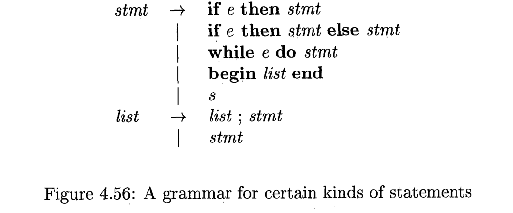

# Exercises 4.8

## Problem 1

### Problem Description

The following is an ambiguous grammar for expressions with $n$ binary, infix operators, at $n$ different levels of precedence:
$$
E\rightarrow E\theta_1E\;|\;E\theta_2E\;|\;\cdots\;E\theta_nE\;|\;(E)\;|\;\textbf{id}
$$
a) As a function of $n$, what are the SLR sets of items?

b) How would you resolve the conflicts in the SLR items so that all operators are left associative, and $\theta_1$ takes precedence over $\theta_2$, which takes precedence over $\theta_3$, and so on?

c) Show the SLR parsing table that results from your decisions in part (b).

d) Repeat parts (a) and (c) for the unambiguous grammar, which defines the same set of expressions, shown in Fig. 4.55.

e) How do the counts of the number of sets of items and the sizes of the tables for the two (ambiguous and unambiguous) grammars compare? What does that comparison tell you about the use of ambiguous expression grammars?

### Solution

#### a

The augmented grammar is
$$
S\rightarrow E\\
E\rightarrow E\theta_1E\;|\;E\theta_2E\;|\;\cdots\;E\theta_nE\;|\;(E)\;|\;\textbf{id}
$$
The SLR table would look like

| Kernel                                                       | Nonkernel                                                    | $E$                                                          | $\theta_1$                      | $\theta_2$                      | $\cdots$ | $\theta_n$                      | $($                     | $)$                    | id                             |
| ------------------------------------------------------------ | ------------------------------------------------------------ | ------------------------------------------------------------ | ------------------------------- | ------------------------------- | -------- | ------------------------------- | ----------------------- | ---------------------- | ------------------------------ |
| $S\rightarrow\cdot E$                                        | $E\rightarrow\cdot E\theta_1E\\E\rightarrow\cdot E\theta_2E\\\vdots\\E\rightarrow\cdot E\theta_nE\\E\rightarrow\cdot(E)\\E\rightarrow\cdot\textbf{id}$ | $S\rightarrow E\cdot\\E\rightarrow E\cdot\theta_1E\\E\rightarrow E\cdot\theta_2E\\\vdots\\E\rightarrow E\cdot\theta_nE$ |                                 |                                 |          |                                 | $E\rightarrow(\cdot E)$ |                        | $E\rightarrow\textbf{id}\cdot$ |
|                                                              |                                                              |                                                              |                                 |                                 |          |                                 |                         |                        |                                |
| $S\rightarrow E\cdot\\E\rightarrow E\cdot\theta_1E\\E\rightarrow E\cdot\theta_2E\\\vdots\\E\rightarrow E\cdot\theta_nE$ |                                                              |                                                              | $E\rightarrow E\theta_1\cdot E$ | $E\rightarrow E\theta_2\cdot E$ | $\cdots$ | $E\rightarrow E\theta_n\cdot E$ |                         |                        |                                |
|                                                              |                                                              |                                                              |                                 |                                 |          |                                 |                         |                        |                                |
| $E\rightarrow (\cdot E)$                                     | $E\rightarrow\cdot E\theta_1E\\E\rightarrow\cdot E\theta_2E\\\vdots\\E\rightarrow\cdot E\theta_nE\\E\rightarrow\cdot(E)\\E\rightarrow\cdot\textbf{id}$ | $E\rightarrow (E\cdot)\\E\rightarrow E\cdot\theta_1E\\E\rightarrow E\cdot\theta_2E\\\vdots\\E\rightarrow E\cdot\theta_nE$ |                                 |                                 |          |                                 | $E\rightarrow(\cdot E)$ |                        | $E\rightarrow\textbf{id}\cdot$ |
|                                                              |                                                              |                                                              |                                 |                                 |          |                                 |                         |                        |                                |
| $E\rightarrow E\theta_1\cdot E$                              | $E\rightarrow\cdot E\theta_1E\\E\rightarrow\cdot E\theta_2E\\\vdots\\E\rightarrow\cdot E\theta_nE\\E\rightarrow\cdot(E)\\E\rightarrow\cdot\textbf{id}$ | $E\rightarrow E\theta_1E\cdot\\E\rightarrow E\cdot\theta_1E\\E\rightarrow E\cdot\theta_2E\\\vdots\\E\rightarrow E\cdot\theta_nE$ |                                 |                                 |          |                                 | $E\rightarrow(\cdot E)$ |                        | $E\rightarrow\textbf{id}\cdot$ |
|                                                              |                                                              |                                                              |                                 |                                 |          |                                 |                         |                        |                                |
| $E\rightarrow E\theta_2\cdot E$                              | $E\rightarrow\cdot E\theta_1E\\E\rightarrow\cdot E\theta_2E\\\vdots\\E\rightarrow\cdot E\theta_nE\\E\rightarrow\cdot(E)\\E\rightarrow\cdot\textbf{id}$ | $E\rightarrow E\theta_2E\cdot\\E\rightarrow E\cdot\theta_1E\\E\rightarrow E\cdot\theta_2E\\\vdots\\E\rightarrow E\cdot\theta_nE$ |                                 |                                 |          |                                 | $E\rightarrow(\cdot E)$ |                        | $E\rightarrow\textbf{id}\cdot$ |
|                                                              |                                                              |                                                              |                                 |                                 |          |                                 |                         |                        |                                |
| $\vdots$                                                     | $\vdots$                                                     | $\vdots$                                                     |                                 |                                 |          |                                 | $\vdots$                |                        | $\vdots$                       |
|                                                              |                                                              |                                                              |                                 |                                 |          |                                 |                         |                        |                                |
| $E\rightarrow E\theta_n\cdot E$                              | $E\rightarrow\cdot E\theta_1E\\E\rightarrow\cdot E\theta_2E\\\vdots\\E\rightarrow\cdot E\theta_nE\\E\rightarrow\cdot(E)\\E\rightarrow\cdot\textbf{id}$ | $E\rightarrow E\theta_nE\cdot\\E\rightarrow E\cdot\theta_1E\\E\rightarrow E\cdot\theta_2E\\\vdots\\E\rightarrow E\cdot\theta_nE$ |                                 |                                 |          |                                 | $E\rightarrow(\cdot E)$ |                        | $E\rightarrow\textbf{id}\cdot$ |
|                                                              |                                                              |                                                              |                                 |                                 |          |                                 |                         |                        |                                |
| $E\rightarrow (E\cdot)\\E\rightarrow E\cdot\theta_1E\\E\rightarrow E\cdot\theta_2E\\\vdots\\E\rightarrow E\cdot\theta_nE$ |                                                              |                                                              | $E\rightarrow E\theta_1\cdot E$ | $E\rightarrow E\theta_2\cdot E$ | $\cdots$ | $E\rightarrow E\theta_n\cdot E$ |                         | $E\rightarrow(E)\cdot$ |                                |
|                                                              |                                                              |                                                              |                                 |                                 |          |                                 |                         |                        |                                |
| $E\rightarrow E\theta_1E\cdot\\E\rightarrow E\cdot\theta_1E\\E\rightarrow E\cdot\theta_2E\\\vdots\\E\rightarrow E\cdot\theta_nE$ |                                                              |                                                              | $E\rightarrow E\theta_1\cdot E$ | $E\rightarrow E\theta_2\cdot E$ | $\cdots$ | $E\rightarrow E\theta_n\cdot E$ |                         |                        |                                |
|                                                              |                                                              |                                                              |                                 |                                 |          |                                 |                         |                        |                                |
| $E\rightarrow E\theta_2E\cdot\\E\rightarrow E\cdot\theta_1E\\E\rightarrow E\cdot\theta_2E\\\vdots\\E\rightarrow E\cdot\theta_nE$ |                                                              |                                                              | $E\rightarrow E\theta_1\cdot E$ | $E\rightarrow E\theta_2\cdot E$ | $\cdots$ | $E\rightarrow E\theta_n\cdot E$ |                         |                        |                                |
|                                                              |                                                              |                                                              |                                 |                                 |          |                                 |                         |                        |                                |
| $\vdots$                                                     |                                                              |                                                              | $\vdots$                        | $\vdots$                        | $\vdots$ | $\vdots$                        |                         |                        |                                |
|                                                              |                                                              |                                                              |                                 |                                 |          |                                 |                         |                        |                                |
| $E\rightarrow E\theta_nE\cdot\\E\rightarrow E\cdot\theta_1E\\E\rightarrow E\cdot\theta_2E\\\vdots\\E\rightarrow E\cdot\theta_nE$ |                                                              |                                                              | $E\rightarrow E\theta_1\cdot E$ | $E\rightarrow E\theta_2\cdot E$ | $\cdots$ | $E\rightarrow E\theta_n\cdot E$ |                         |                        |                                |
|                                                              |                                                              |                                                              |                                 |                                 |          |                                 |                         |                        |                                |
| $E\rightarrow\textbf{id}\cdot$                               |                                                              |                                                              |                                 |                                 |          |                                 |                         |                        |                                |
|                                                              |                                                              |                                                              |                                 |                                 |          |                                 |                         |                        |                                |
| $E\rightarrow(E)\cdot$                                       |                                                              |                                                              |                                 |                                 |          |                                 |                         |                        |                                |

#### b

Whenever the top of the stack is $E\theta_i E$, consider the following $\theta_j$ which would cause shift-reduce conflict. When $j<i$ perform shift, otherwise reduce.

#### c

First, initialize the GOTO table

|            | $\theta_1$ | $\theta_2$ | $\cdots$ | $\theta_n$ | $($  | $)$   | id    |
| ---------- | ---------- | ---------- | -------- | ---------- | ---- | ----- | ----- |
| $S_0$      |            |            |          |            | s2   |       | s2n+5 |
| $S_1$      | s3         | s4         | $\cdots$ | sn+2       |      |       |       |
| $S_2$      |            |            |          |            | s2   |       | s2n+5 |
| $S_3$      |            |            |          |            | s2   |       | s2n+5 |
| $S_4$      |            |            |          |            | s2   |       | s2n+5 |
| $\vdots$   |            |            |          |            |      |       |       |
| $S_{n+2}$  |            |            |          |            | s2   |       | s2n+5 |
| $S_{n+3}$  | s3         | s4         | $\cdots$ | sn+2       |      | s2n+4 |       |
| $S_{n+4}$  | s3         | s4         | $\cdots$ | sn+2       |      |       |       |
| $S_{n+5}$  | s3         | s4         | $\cdots$ | sn+2       |      |       |       |
| $\vdots$   | $\vdots$   | $\vdots$   | $\vdots$ | $\vdots$   |      |       |       |
| $S_{2n+3}$ | s3         | s4         | $\cdots$ | sn+2       |      |       |       |
| $S_{2n+4}$ |            |            |          |            |      |       |       |
| $S_{2n+5}$ |            |            |          |            |      |       |       |

Obviously, the FOLLOW table is

|      | FOLLOW                                       |
| ---- | -------------------------------------------- |
| $E$  | $\{\$,\theta_1,\theta_2,\cdots,\theta_n,)\}$ |

Let ri represents $E\rightarrow E\theta_iE$, rn+1 represents $E\rightarrow\textbf{id}\cdot$ and rn+2 represents $E\rightarrow(E)\cdot$. Then we can refine the GOTO table

|            | $\theta_1$ | $\theta_2$ | $\cdots$ | $\theta_n$ | $($  | $)$   | id    | \$     |
| ---------- | ---------- | ---------- | -------- | ---------- | ---- | ----- | ----- | ------ |
| $S_0$      |            |            |          |            | s2   |       | s2n+5 |        |
| $S_1$      | s3         | s4         | $\cdots$ | sn+2       |      |       |       | accept |
| $S_2$      |            |            |          |            | s2   |       | s2n+5 |        |
| $S_3$      |            |            |          |            | s2   |       | s2n+5 |        |
| $S_4$      |            |            |          |            | s2   |       | s2n+5 |        |
| $\vdots$   |            |            |          |            |      |       |       |        |
| $S_{n+2}$  |            |            |          |            | s2   |       | s2n+5 |        |
| $S_{n+3}$  | s3         | s4         | $\cdots$ | sn+2       |      | s2n+4 |       |        |
| $S_{n+4}$  | s3         | s4         | $\cdots$ | sn+2       |      | r1    |       | r1     |
|            | r1         | r1         | $\cdots$ | r1         |      |       |       |        |
| $S_{n+5}$  | s3         | s4         | $\cdots$ | sn+2       |      | r2    |       | r2     |
|            | r2         | r2         | $\cdots$ | r2         |      |       |       |        |
| $\vdots$   | $\vdots$   | $\vdots$   | $\vdots$ | $\vdots$   |      |       |       |        |
| $S_{2n+3}$ | s3         | s4         | $\cdots$ | sn+2       |      | rn    |       | rn     |
|            | rn         | rn         | $\cdots$ | rn         |      |       |       |        |
| $S_{2n+4}$ | rn+1       | rn+1       | $\cdots$ | rn+1       |      | rn+1  |       | rn+1   |
| $S_{2n+5}$ | rn+2       | rn+2       | $\cdots$ | rn+2       |      | rn+2  |       | rn+2   |

Applying the unambiguous rule:

|            | $\theta_1$ | $\theta_2$ | $\cdots$ | $\theta_n$ | $($  | $)$   | id    | \$     |
| ---------- | ---------- | ---------- | -------- | ---------- | ---- | ----- | ----- | ------ |
| $S_0$      |            |            |          |            | s2   |       | s2n+5 |        |
| $S_1$      | s3         | s4         | $\cdots$ | sn+2       |      |       |       | accept |
| $S_2$      |            |            |          |            | s2   |       | s2n+5 |        |
| $S_3$      |            |            |          |            | s2   |       | s2n+5 |        |
| $S_4$      |            |            |          |            | s2   |       | s2n+5 |        |
| $\vdots$   |            |            |          |            |      |       |       |        |
| $S_{n+2}$  |            |            |          |            | s2   |       | s2n+5 |        |
| $S_{n+3}$  | s3         | s4         | $\cdots$ | sn+2       |      | s2n+4 |       |        |
| $S_{n+4}$  | r1         | r1         | $\cdots$ | r1         |      | r1    |       | r1     |
| $S_{n+5}$  | s3         | r2         | $\cdots$ | r2         |      | r2    |       | r2     |
| $\vdots$   | $\vdots$   | $\vdots$   | $\vdots$ | $\vdots$   |      |       |       |        |
| $S_{2n+3}$ | s3         | s4         | $\cdots$ | rn         |      | rn    |       | rn     |
| $S_{2n+4}$ | rn+1       | rn+1       | $\cdots$ | rn+1       |      | rn+1  |       | rn+1   |
| $S_{2n+5}$ | rn+2       | rn+2       | $\cdots$ | rn+2       |      | rn+2  |       | rn+2   |

#### d

The augmented grammar is
$$
S\rightarrow E_1\\
E_1\rightarrow E_1\theta_1 E_2\;|\;E_2\\
E_2\rightarrow E_2\theta_2 E_3\;|\;E_3\\
\cdots\\
E_n\rightarrow E_n\theta_n E_{n+1}\;|\;E_{n+1}\\
E_{n+1}\rightarrow (E_1)\;|\;\textbf{id}
$$

The SLR table would look like

| Kernel                                                       | Nonkernel                                                    | $E_1$                                                        | $E_2$                                                        | $\cdots$ | $E_n$                                                        | $E_{n+1}$                     | $\theta_1$                            | $\theta_2$                            | $\cdots$ | $\theta_n$                                | $($                              | $)$                            | $\textbf{id}$                         |
| ------------------------------------------------------------ | ------------------------------------------------------------ | ------------------------------------------------------------ | ------------------------------------------------------------ | -------- | ------------------------------------------------------------ | ----------------------------- | ------------------------------------- | ------------------------------------- | -------- | ----------------------------------------- | -------------------------------- | ------------------------------ | ------------------------------------- |
| $S\rightarrow\cdot E_1$                                      | $E_1\rightarrow\cdot E_1\theta_1 E_2\\E_1\rightarrow\cdot E_2\\E_2\rightarrow\cdot E_2\theta_2 E_3\\E_2\rightarrow\cdot E_3\\\vdots\\E_n\rightarrow\cdot E_n\theta_n E_{n+1}\\E_n\rightarrow\cdot E_{n+1}\\E_{n+1}\rightarrow\cdot(E_1)\\E_{n+1}\rightarrow\cdot\textbf{id}$ | $S\rightarrow E_1\cdot\\E_1\rightarrow E_1\cdot\theta_1 E_2$ | $E_1\rightarrow E_2\cdot\\E_2\rightarrow E_2\cdot\theta_2 E_3$ | $\cdots$ | $E_{n-1}\rightarrow E_n\cdot\\E_n\rightarrow E_n\cdot\theta_nE_{n+1}$ | $E_n\rightarrow E_{n+1}\cdot$ |                                       |                                       |          |                                           | $E_{n+1}\rightarrow (\cdot E_1)$ |                                | $E_{n+1}\rightarrow \textbf{id}\cdot$ |
|                                                              |                                                              |                                                              |                                                              |          |                                                              |                               |                                       |                                       |          |                                           |                                  |                                |                                       |
| $S\rightarrow E_1\cdot\\E_1\rightarrow E_1\cdot\theta_1 E_2$ |                                                              |                                                              |                                                              |          |                                                              |                               | $E_1\rightarrow E_1\theta_1\cdot E_2$ |                                       |          |                                           |                                  |                                |                                       |
|                                                              |                                                              |                                                              |                                                              |          |                                                              |                               |                                       |                                       |          |                                           |                                  |                                |                                       |
| $E_1\rightarrow E_2\cdot\\E_2\rightarrow E_2\cdot\theta_2 E_3$ |                                                              |                                                              |                                                              |          |                                                              |                               |                                       | $E_2\rightarrow E_2\theta_2\cdot E_3$ |          |                                           |                                  |                                |                                       |
|                                                              |                                                              |                                                              |                                                              |          |                                                              |                               |                                       |                                       |          |                                           |                                  |                                |                                       |
| $\vdots$                                                     |                                                              |                                                              |                                                              |          |                                                              |                               |                                       |                                       |          |                                           |                                  |                                |                                       |
|                                                              |                                                              |                                                              |                                                              |          |                                                              |                               |                                       |                                       |          |                                           |                                  |                                |                                       |
| $E_{n-1}\rightarrow E_n\cdot\\E_n\rightarrow E_n\cdot\theta_nE_{n+1}$ |                                                              |                                                              |                                                              |          |                                                              |                               |                                       |                                       |          | $E_n\rightarrow E_n\theta_n\cdot E_{n+1}$ |                                  |                                |                                       |
|                                                              |                                                              |                                                              |                                                              |          |                                                              |                               |                                       |                                       |          |                                           |                                  |                                |                                       |
| $E_{n+1}\rightarrow (\cdot E_1)$                             | $E_1\rightarrow\cdot E_1\theta_1 E_2\\E_1\rightarrow\cdot E_2\\E_2\rightarrow\cdot E_2\theta_2 E_3\\E_2\rightarrow\cdot E_3\\\vdots\\E_n\rightarrow\cdot E_n\theta_n E_{n+1}\\E_n\rightarrow\cdot E_{n+1}\\E_{n+1}\rightarrow\cdot(E_1)\\E_{n+1}\rightarrow\cdot\textbf{id}$ | $E_{n+1}\rightarrow(E_1\cdot)\\E_1\rightarrow E_1\cdot\theta_1 E_2$ | $E_1\rightarrow E_2\cdot\\E_2\rightarrow E_2\cdot\theta_2 E_3$ | $\cdots$ | $E_{n-1}\rightarrow E_n\cdot\\E_n\rightarrow E_n\cdot\theta_nE_{n+1}$ | $E_n\rightarrow E_{n+1}\cdot$ |                                       |                                       |          |                                           | $E_{n+1}\rightarrow (\cdot E_1)$ |                                | $E_{n+1}\rightarrow \textbf{id}\cdot$ |
|                                                              |                                                              |                                                              |                                                              |          |                                                              |                               |                                       |                                       |          |                                           |                                  |                                |                                       |
| $E_1\rightarrow E_1\theta_1\cdot E_2$                        | $E_2\rightarrow\cdot E_2\theta_2 E_3\\E_2\rightarrow\cdot E_3\\\vdots\\E_n\rightarrow\cdot E_n\theta_n E_{n+1}\\E_n\rightarrow\cdot E_{n+1}\\E_{n+1}\rightarrow\cdot(E_1)\\E_{n+1}\rightarrow\cdot\textbf{id}$ |                                                              | $E_1\rightarrow E_1\theta_1E_2\cdot\\E_2\rightarrow E_2\cdot\theta_2E_3$ | $\cdots$ | $E_{n-1}\rightarrow E_n\cdot\\E_n\rightarrow E_n\cdot\theta_nE_{n+1}$ | $E_n\rightarrow E_{n+1}\cdot$ |                                       |                                       |          |                                           | $E_{n+1}\rightarrow (\cdot E_1)$ |                                | $E_{n+1}\rightarrow \textbf{id}\cdot$ |
|                                                              |                                                              |                                                              |                                                              |          |                                                              |                               |                                       |                                       |          |                                           |                                  |                                |                                       |
| $E_2\rightarrow E_2\theta_2\cdot E_3$                        | $\vdots\\E_n\rightarrow\cdot E_n\theta_n E_{n+1}\\E_n\rightarrow\cdot E_{n+1}\\E_{n+1}\rightarrow\cdot(E_1)\\E_{n+1}\rightarrow\cdot\textbf{id}$ |                                                              |                                                              | $\cdots$ | $E_{n-1}\rightarrow E_n\cdot\\E_n\rightarrow E_n\cdot\theta_nE_{n+1}$ | $E_n\rightarrow E_{n+1}\cdot$ |                                       |                                       |          |                                           | $E_{n+1}\rightarrow (\cdot E_1)$ |                                | $E_{n+1}\rightarrow \textbf{id}\cdot$ |
|                                                              |                                                              |                                                              |                                                              |          |                                                              |                               |                                       |                                       |          |                                           | $\vdots$                         |                                | $\vdots$                              |
| $\vdots$                                                     |                                                              |                                                              |                                                              |          |                                                              |                               |                                       |                                       |          |                                           |                                  |                                |                                       |
|                                                              |                                                              |                                                              |                                                              |          |                                                              |                               |                                       |                                       |          |                                           |                                  |                                |                                       |
| $E_n\rightarrow E_n\theta_n\cdot E_{n+1}$                    | $E_{n+1}\rightarrow\cdot(E_1)\\E_{n+1}\rightarrow\cdot\textbf{id}$ |                                                              |                                                              |          |                                                              |                               |                                       |                                       |          |                                           | $E_{n+1}\rightarrow (\cdot E_1)$ |                                | $E_{n+1}\rightarrow \textbf{id}\cdot$ |
|                                                              |                                                              |                                                              |                                                              |          |                                                              |                               |                                       |                                       |          |                                           |                                  |                                |                                       |
| $E_{n+1}\rightarrow(E_1\cdot)\\E_1\rightarrow E_1\cdot\theta_1 E_2$ |                                                              |                                                              |                                                              |          |                                                              |                               | $E_1\rightarrow E_1\theta_1\cdot E_2$ |                                       |          |                                           |                                  | $E_{n+1}\rightarrow(E_1)\cdot$ |                                       |
|                                                              |                                                              |                                                              |                                                              |          |                                                              |                               |                                       |                                       |          |                                           |                                  |                                |                                       |
| $E_1\rightarrow E_1\theta_1E_2\cdot\\E_2\rightarrow E_2\cdot\theta_2E_3$ |                                                              |                                                              |                                                              |          |                                                              |                               |                                       | $E_2\rightarrow E_2\theta_2\cdot E_3$ |          |                                           |                                  |                                |                                       |
|                                                              |                                                              |                                                              |                                                              |          |                                                              |                               |                                       |                                       |          |                                           |                                  |                                |                                       |
| $\vdots$                                                     |                                                              |                                                              |                                                              |          |                                                              |                               |                                       |                                       |          |                                           |                                  |                                |                                       |
|                                                              |                                                              |                                                              |                                                              |          |                                                              |                               |                                       |                                       |          |                                           |                                  |                                |                                       |
| $E_{n-1}\rightarrow E_n\cdot\\E_n\rightarrow E_n\cdot\theta_nE_{n+1}$ |                                                              |                                                              |                                                              |          |                                                              |                               |                                       |                                       |          | $E_n\rightarrow E_n\theta_n\cdot E_{n+1}$ |                                  |                                |                                       |
|                                                              |                                                              |                                                              |                                                              |          |                                                              |                               |                                       |                                       |          |                                           |                                  |                                |                                       |
| $E_n\rightarrow E_{n+1}\cdot$                                |                                                              |                                                              |                                                              |          |                                                              |                               |                                       |                                       |          |                                           |                                  |                                |                                       |
|                                                              |                                                              |                                                              |                                                              |          |                                                              |                               |                                       |                                       |          |                                           |                                  |                                |                                       |
| $E_{n+1}\rightarrow \textbf{id}\cdot$                        |                                                              |                                                              |                                                              |          |                                                              |                               |                                       |                                       |          |                                           |                                  |                                |                                       |
|                                                              |                                                              |                                                              |                                                              |          |                                                              |                               |                                       |                                       |          |                                           |                                  |                                |                                       |
| $E_{n+1}\rightarrow(E_1)\cdot$                               |                                                              |                                                              |                                                              |          |                                                              |                               |                                       |                                       |          |                                           |                                  |                                |                                       |

First, initialize the GOTO table

|            | $\theta_1$ | $\theta_2$ | $\cdots$ | $\theta_n$ | $($      | $)$   | id       | $\$$   |
| ---------- | ---------- | ---------- | -------- | ---------- | -------- | ----- | -------- | ------ |
| $S_0$      |            |            |          |            | sn+1     |       | s3n+3    |        |
| $S_1$      | sn+2       |            |          |            |          |       |          | accept |
| $S_2$      |            | sn+3       |          |            |          |       |          |        |
| $\vdots$   |            |            | $\ddots$ |            |          |       |          |        |
| $S_n$      |            |            |          | s2n+1      |          |       |          |        |
| $S_{n+1}$  |            |            |          |            | sn+1     |       | s3n+3    |        |
| $S_{n+2}$  |            |            |          |            | sn+1     |       | s3n+3    |        |
| $S_{n+3}$  |            |            |          |            | sn+1     |       | s3n+3    |        |
| $\vdots$   |            |            |          |            | $\vdots$ |       | $\vdots$ |        |
| $S_{2n+1}$ |            |            |          |            | sn+1     |       | s3n+3    |        |
| $S_{2n+2}$ | sn+2       |            |          |            |          | s3n+4 |          |        |
| $S_{2n+3}$ |            | sn+3       |          |            |          |       |          |        |
| $\vdots$   |            |            | $\ddots$ |            |          |       |          |        |
| $S_{3n+1}$ |            |            |          | $s2n+1$    |          |       |          |        |
| $S_{3n+2}$ |            |            |          |            |          |       |          |        |
| $S_{3n+3}$ |            |            |          |            |          |       |          |        |
| $S_{3n+4}$ |            |            |          |            |          |       |          |        |

Obviously, the FOLLOW table is

|           | FOLLOW                                       |
| --------- | -------------------------------------------- |
| $E_1$     | $\{\$,\theta_1,)\}$                          |
| $E_2$     | $\{\$,\theta_1,\theta_2,)\}$                 |
| $\vdots$  | $\vdots$                                     |
| $E_n$     | $\{\$,\theta_1,\theta_2,\cdots,\theta_n,)\}$ |
| $E_{n+1}$ | $\{\$,\theta_1,\theta_2,\cdots,\theta_n,)\}$ |

Represent items by ri, where i is the row number when they first occurence in GOTO table, then we can refine

|            | $\theta_1$ | $\theta_2$ | $\cdots$ | $\theta_n$ | $($      | $)$      | id       | $\$$     |
| ---------- | ---------- | ---------- | -------- | ---------- | -------- | -------- | -------- | -------- |
| $S_0$      |            |            |          |            | sn+1     |          | s3n+3    |          |
| $S_1$      | sn+2       |            |          |            |          |          |          | accept   |
| $S_2$      | r1         | sn+3       |          |            |          | r1       |          | r1       |
| $\vdots$   | $\vdots$   | $\vdots$   | $\ddots$ |            |          | $\vdots$ |          | $\vdots$ |
| $S_n$      | rn-1       | rn-1       | $\cdots$ | s2n+1      |          | rn-1     |          | rn-1     |
| $S_{n+1}$  |            |            |          |            | sn+1     |          | s3n+3    |          |
| $S_{n+2}$  |            |            |          |            | sn+1     |          | s3n+3    |          |
| $S_{n+3}$  |            |            |          |            | sn+1     |          | s3n+3    |          |
| $\vdots$   |            |            |          |            | $\vdots$ |          | $\vdots$ |          |
| $S_{2n+1}$ |            |            |          |            | sn+1     |          | s3n+3    |          |
| $S_{2n+2}$ | sn+2       |            |          |            |          | s3n+4    |          |          |
| $S_{2n+3}$ | rn         | sn+3       |          |            |          | rn       |          | rn       |
| $\vdots$   | $\vdots$   | $\vdots$   | $\ddots$ |            |          | $\vdots$ |          | $\vdots$ |
| $S_{3n+1}$ | r2n-2      | r2n-2      | $\cdots$ | s2n+1      |          | r2n-2    |          | r2n-2    |
| $S_{3n+2}$ | r2n-1      | r2n-1      | $\cdots$ | r2n-1      |          | r2n-1    |          | r2n-1    |
| $S_{3n+3}$ | r2n        | r2n        | $\cdots$ | r2n        |          | r2n      |          | r2n      |
| $S_{3n+4}$ | r2n+1      | r2n+1      | $\cdots$ | r2n+1      |          | r2n+1    |          | r2n+1    |

#### e

Ambiguous grammar requires $2n+5$ items, however unambiguous grammar requires $3n+4$ items. This tells us the usage of ambiguous grammar, together with rules to make it unambiguous, can actually make the grammar more concise.

## Problem 2

### Problem Description

In Fig. 4.56 is a grammar for certain statements, similar to that discussed in Exercise 4.4.12. Again, $e$ and $s$ are terminals standing for conditional expressions and “other statements,” respectively.

a) Build an LR parsing table for this grammar, resolving conflicts in the usual way for the dangling-else problem.

b) Implement error correction by filling in the blank entries in the parsing table with extra reduce-actions or suitable error-recovery routines.

c) Show the behavior of your parser on the following inputs:

​	i) **if $e$ then $s$; if $e$ then $s$ end**

​	ii) **while $e$ do begin $s$; if $e$ then $s$; end**

### Solution

The augmented grammar is
$$
S\rightarrow stmt\\
stmt\rightarrow\textbf{if }e\textbf{ then }stmt\\
stmt\rightarrow\textbf{if }e\textbf{ then }stmt\textbf{ else }stmt\\
stmt\rightarrow\textbf{while }e\textbf{ do }stmt\\
stmt\rightarrow\textbf{begin }list\textbf{ end}\\
stmt\rightarrow s\\
list\rightarrow list;stmt\\
list\rightarrow stmt
$$
The LR parsing table is

| Kernel                                                       | Nonkernel                                                    | $stmt$                                                       | $list$                                                       | if                                                           | then                                                         | else                                                         | while                                                   | do                                                       | begin                                                  | end                                                     | $e$                                                          | $s$                      | ;                                 |
| ------------------------------------------------------------ | ------------------------------------------------------------ | ------------------------------------------------------------ | ------------------------------------------------------------ | ------------------------------------------------------------ | ------------------------------------------------------------ | ------------------------------------------------------------ | ------------------------------------------------------- | -------------------------------------------------------- | ------------------------------------------------------ | ------------------------------------------------------- | ------------------------------------------------------------ | ------------------------ | --------------------------------- |
| $S\rightarrow\cdot stmt$                                     | $stmt\rightarrow\cdot\textbf{if }e\textbf{ then }stmt\\stmt\rightarrow\cdot\textbf{if }e\textbf{ then }stmt\textbf{ else }stmt\\stmt\rightarrow\cdot \textbf{while }e\textbf{ do }stmt\\stmt\rightarrow\cdot \textbf{begin }list\textbf{ end}\\stmt\rightarrow\cdot s$ | $S\rightarrow stmt\cdot$                                     |                                                              | $stmt\rightarrow\textbf{if}\cdot e\textbf{ then }stmt\\stmt\rightarrow\textbf{if}\cdot e\textbf{ then }stmt\textbf{ else }stmt$ |                                                              |                                                              | $stmt\rightarrow\textbf{while}\cdot e\textbf{ do }stmt$ |                                                          | $stmt\rightarrow\textbf{begin}\cdot list\textbf{ end}$ |                                                         |                                                              | $stmt\rightarrow s\cdot$ |                                   |
|                                                              |                                                              |                                                              |                                                              |                                                              |                                                              |                                                              |                                                         |                                                          |                                                        |                                                         |                                                              |                          |                                   |
| $stmt\rightarrow\textbf{if}\cdot e\textbf{ then }stmt\\stmt\rightarrow\textbf{if}\cdot e\textbf{ then }stmt\textbf{ else }stmt$ |                                                              |                                                              |                                                              |                                                              |                                                              |                                                              |                                                         |                                                          |                                                        |                                                         | $stmt\rightarrow\textbf{if }e\cdot\textbf{then }stmt\\stmt\rightarrow\textbf{if }e\cdot\textbf{then }stmt\textbf{ else }stmt$ |                          |                                   |
|                                                              |                                                              |                                                              |                                                              |                                                              |                                                              |                                                              |                                                         |                                                          |                                                        |                                                         |                                                              |                          |                                   |
| $stmt\rightarrow\textbf{while}\cdot e\textbf{ do }stmt$      |                                                              |                                                              |                                                              |                                                              |                                                              |                                                              |                                                         |                                                          |                                                        |                                                         | $stmt\rightarrow\textbf{while } e\cdot\textbf{do }stmt$      |                          |                                   |
|                                                              |                                                              |                                                              |                                                              |                                                              |                                                              |                                                              |                                                         |                                                          |                                                        |                                                         |                                                              |                          |                                   |
| $stmt\rightarrow\textbf{begin}\cdot list\textbf{ end}$       | $stmt\rightarrow\cdot\textbf{if }e\textbf{ then }stmt\\stmt\rightarrow\cdot\textbf{if }e\textbf{ then }stmt\textbf{ else }stmt\\stmt\rightarrow\cdot \textbf{while }e\textbf{ do }stmt\\stmt\rightarrow\cdot \textbf{begin }list\textbf{ end}\\stmt\rightarrow\cdot s\\list\rightarrow\cdot list;stmt\\list\rightarrow\cdot  stmt$ | $list\rightarrow stmt\cdot$                                  | $stmt\rightarrow\textbf{begin } list\cdot\textbf{end}\\list\rightarrow list\cdot;stmt$ | $stmt\rightarrow\textbf{if}\cdot e\textbf{ then }stmt\\stmt\rightarrow\textbf{if}\cdot e\textbf{ then }stmt\textbf{ else }stmt$ |                                                              |                                                              | $stmt\rightarrow\textbf{while}\cdot e\textbf{ do }stmt$ |                                                          | $stmt\rightarrow\textbf{begin}\cdot list\textbf{ end}$ |                                                         |                                                              | $stmt\rightarrow s\cdot$ |                                   |
|                                                              |                                                              |                                                              |                                                              |                                                              |                                                              |                                                              |                                                         |                                                          |                                                        |                                                         |                                                              |                          |                                   |
| $stmt\rightarrow\textbf{if }e\cdot\textbf{then }stmt\\stmt\rightarrow\textbf{if }e\cdot\textbf{then }stmt\textbf{ else }stmt$ |                                                              |                                                              |                                                              |                                                              | $stmt\rightarrow\textbf{if }e\textbf{ then}\cdot stmt\\stmt\rightarrow\textbf{if }e\textbf{ then}\cdot stmt\textbf{ else }stmt$ |                                                              |                                                         |                                                          |                                                        |                                                         |                                                              |                          |                                   |
|                                                              |                                                              |                                                              |                                                              |                                                              |                                                              |                                                              |                                                         |                                                          |                                                        |                                                         |                                                              |                          |                                   |
| $stmt\rightarrow\textbf{while } e\cdot\textbf{do }stmt$      |                                                              |                                                              |                                                              |                                                              |                                                              |                                                              |                                                         | $stmt\rightarrow\textbf{while } e\textbf{ do}\cdot stmt$ |                                                        |                                                         |                                                              |                          |                                   |
|                                                              |                                                              |                                                              |                                                              |                                                              |                                                              |                                                              |                                                         |                                                          |                                                        |                                                         |                                                              |                          |                                   |
| $stmt\rightarrow\textbf{begin } list\cdot\textbf{end}\\list\rightarrow list\cdot;stmt$ |                                                              |                                                              |                                                              |                                                              |                                                              |                                                              |                                                         |                                                          |                                                        | $stmt\rightarrow\textbf{begin } list\textbf{ end}\cdot$ |                                                              |                          | $list\rightarrow list;\cdot stmt$ |
|                                                              |                                                              |                                                              |                                                              |                                                              |                                                              |                                                              |                                                         |                                                          |                                                        |                                                         |                                                              |                          |                                   |
| $stmt\rightarrow\textbf{if }e\textbf{ then}\cdot stmt\\stmt\rightarrow\textbf{if }e\textbf{ then}\cdot stmt\textbf{ else }stmt$ | $stmt\rightarrow\cdot\textbf{if }e\textbf{ then }stmt\\stmt\rightarrow\cdot\textbf{if }e\textbf{ then }stmt\textbf{ else }stmt\\stmt\rightarrow\cdot \textbf{while }e\textbf{ do }stmt\\stmt\rightarrow\cdot \textbf{begin }list\textbf{ end}\\stmt\rightarrow\cdot s$ | $stmt\rightarrow\textbf{if }e\textbf{ then }stmt\cdot\\stmt\rightarrow\textbf{if }e\textbf{ then } stmt\cdot\textbf{else }stmt$ |                                                              | $stmt\rightarrow\textbf{if}\cdot e\textbf{ then }stmt\\stmt\rightarrow\textbf{if}\cdot e\textbf{ then }stmt\textbf{ else }stmt$ |                                                              |                                                              | $stmt\rightarrow\textbf{while}\cdot e\textbf{ do }stmt$ |                                                          | $stmt\rightarrow\textbf{begin}\cdot list\textbf{ end}$ |                                                         |                                                              | $stmt\rightarrow s\cdot$ |                                   |
|                                                              |                                                              |                                                              |                                                              |                                                              |                                                              |                                                              |                                                         |                                                          |                                                        |                                                         |                                                              |                          |                                   |
| $stmt\rightarrow\textbf{while } e\textbf{ do}\cdot stmt$     | $stmt\rightarrow\cdot\textbf{if }e\textbf{ then }stmt\\stmt\rightarrow\cdot\textbf{if }e\textbf{ then }stmt\textbf{ else }stmt\\stmt\rightarrow\cdot \textbf{while }e\textbf{ do }stmt\\stmt\rightarrow\cdot \textbf{begin }list\textbf{ end}\\stmt\rightarrow\cdot s$ | $stmt\rightarrow\textbf{while } e\textbf{ do }stmt\cdot$     |                                                              | $stmt\rightarrow\textbf{if}\cdot e\textbf{ then }stmt\\stmt\rightarrow\textbf{if}\cdot e\textbf{ then }stmt\textbf{ else }stmt$ |                                                              |                                                              | $stmt\rightarrow\textbf{while}\cdot e\textbf{ do }stmt$ |                                                          | $stmt\rightarrow\textbf{begin}\cdot list\textbf{ end}$ |                                                         |                                                              | $stmt\rightarrow s\cdot$ |                                   |
|                                                              |                                                              |                                                              |                                                              |                                                              |                                                              |                                                              |                                                         |                                                          |                                                        |                                                         |                                                              |                          |                                   |
| $list\rightarrow list;\cdot stmt$$                           | $stmt\rightarrow\cdot\textbf{if }e\textbf{ then }stmt\\stmt\rightarrow\cdot\textbf{if }e\textbf{ then }stmt\textbf{ else }stmt\\stmt\rightarrow\cdot \textbf{while }e\textbf{ do }stmt\\stmt\rightarrow\cdot \textbf{begin }list\textbf{ end}\\stmt\rightarrow\cdot s$ | $list\rightarrow list;stmt\cdot$                             |                                                              | $stmt\rightarrow\textbf{if}\cdot e\textbf{ then }stmt\\stmt\rightarrow\textbf{if}\cdot e\textbf{ then }stmt\textbf{ else }stmt$ |                                                              |                                                              | $stmt\rightarrow\textbf{while}\cdot e\textbf{ do }stmt$ |                                                          | $stmt\rightarrow\textbf{begin}\cdot list\textbf{ end}$ |                                                         |                                                              | $stmt\rightarrow s\cdot$ |                                   |
|                                                              |                                                              |                                                              |                                                              |                                                              |                                                              |                                                              |                                                         |                                                          |                                                        |                                                         |                                                              |                          |                                   |
| $stmt\rightarrow\textbf{if }e\textbf{ then }stmt\cdot\\stmt\rightarrow\textbf{if }e\textbf{ then } stmt\cdot\textbf{else }stmt$ |                                                              |                                                              |                                                              |                                                              |                                                              | $stmt\rightarrow\textbf{if }e\textbf{ then } stmt\textbf{ else}\cdot stmt$ |                                                         |                                                          |                                                        |                                                         |                                                              |                          |                                   |
|                                                              |                                                              |                                                              |                                                              |                                                              |                                                              |                                                              |                                                         |                                                          |                                                        |                                                         |                                                              |                          |                                   |
| $stmt\rightarrow\textbf{if }e\textbf{ then } stmt\textbf{ else}\cdot stmt$ | $stmt\rightarrow\cdot\textbf{if }e\textbf{ then }stmt\\stmt\rightarrow\cdot\textbf{if }e\textbf{ then }stmt\textbf{ else }stmt\\stmt\rightarrow\cdot \textbf{while }e\textbf{ do }stmt\\stmt\rightarrow\cdot \textbf{begin }list\textbf{ end}\\stmt\rightarrow\cdot s$ | $stmt\rightarrow\textbf{if }e\textbf{ then } stmt\textbf{ else } stmt\cdot$ |                                                              | $stmt\rightarrow\textbf{if}\cdot e\textbf{ then }stmt\\stmt\rightarrow\textbf{if}\cdot e\textbf{ then }stmt\textbf{ else }stmt$ |                                                              |                                                              | $stmt\rightarrow\textbf{while}\cdot e\textbf{ do }stmt$ |                                                          | $stmt\rightarrow\textbf{begin}\cdot list\textbf{ end}$ |                                                         |                                                              | $stmt\rightarrow s\cdot$ |                                   |
|                                                              |                                                              |                                                              |                                                              |                                                              |                                                              |                                                              |                                                         |                                                          |                                                        |                                                         |                                                              |                          |                                   |
| $$S\rightarrow stmt\cdot$$                                   |                                                              |                                                              |                                                              |                                                              |                                                              |                                                              |                                                         |                                                          |                                                        |                                                         |                                                              |                          |                                   |
|                                                              |                                                              |                                                              |                                                              |                                                              |                                                              |                                                              |                                                         |                                                          |                                                        |                                                         |                                                              |                          |                                   |
| $stmt\rightarrow s\cdot$                                     |                                                              |                                                              |                                                              |                                                              |                                                              |                                                              |                                                         |                                                          |                                                        |                                                         |                                                              |                          |                                   |
|                                                              |                                                              |                                                              |                                                              |                                                              |                                                              |                                                              |                                                         |                                                          |                                                        |                                                         |                                                              |                          |                                   |
| $$list\rightarrow stmt\cdot$$                                |                                                              |                                                              |                                                              |                                                              |                                                              |                                                              |                                                         |                                                          |                                                        |                                                         |                                                              |                          |                                   |
|                                                              |                                                              |                                                              |                                                              |                                                              |                                                              |                                                              |                                                         |                                                          |                                                        |                                                         |                                                              |                          |                                   |
| $stmt\rightarrow\textbf{begin } list\textbf{ end}\cdot$      |                                                              |                                                              |                                                              |                                                              |                                                              |                                                              |                                                         |                                                          |                                                        |                                                         |                                                              |                          |                                   |
|                                                              |                                                              |                                                              |                                                              |                                                              |                                                              |                                                              |                                                         |                                                          |                                                        |                                                         |                                                              |                          |                                   |
| $stmt\rightarrow\textbf{while } e\textbf{ do }stmt\cdot$     |                                                              |                                                              |                                                              |                                                              |                                                              |                                                              |                                                         |                                                          |                                                        |                                                         |                                                              |                          |                                   |
|                                                              |                                                              |                                                              |                                                              |                                                              |                                                              |                                                              |                                                         |                                                          |                                                        |                                                         |                                                              |                          |                                   |
| $list\rightarrow list;stmt\cdot$                             |                                                              |                                                              |                                                              |                                                              |                                                              |                                                              |                                                         |                                                          |                                                        |                                                         |                                                              |                          |                                   |
|                                                              |                                                              |                                                              |                                                              |                                                              |                                                              |                                                              |                                                         |                                                          |                                                        |                                                         |                                                              |                          |                                   |
| $stmt\rightarrow\textbf{if }e\textbf{ then } stmt\textbf{ else } stmt\cdot$ |                                                              |                                                              |                                                              |                                                              |                                                              |                                                              |                                                         |                                                          |                                                        |                                                         |                                                              |                          |                                   |

Initialize the GOTO table

|            | if   | then | else | while | do   | begin | end  | $e$  | $s$  | ;      |
| ---------- | ---- | ---- | ---- | ----- | ---- | ----- | ---- | ---- | ---- | ------ |
| $S_0$      | s1   |      |      | s2    |      | s3    |      |      | s13  |        |
| $S_1$      |      |      |      |       |      |       |      | s4   |      |        |
| $S_2$      |      |      |      |       |      |       |      | s5   |      |        |
| $S_3$      | s1   |      |      | s2    |      | s3    |      |      | s13  |        |
| $S_4$      |      | s7   |      |       |      |       |      |      |      |        |
| $S_5$      |      |      |      |       | s8   |       |      |      |      |        |
| $S_6$      |      |      |      |       |      |       | s15  |      |      | s9     |
| $S_7$      | s1   |      |      | s2    |      | s3    |      |      | s13  |        |
| $S_8$      | s1   |      |      | s2    |      | s3    |      |      | s13  |        |
| $S_9$      | s1   |      |      | s2    |      | s3    |      |      | s13  |        |
| $S_{10}$   |      |      | s11  |       |      |       |      |      |      |        |
| $S_{11}$   | s1   |      |      | s2    |      | s3    |      |      | s13  |        |
| $$S_{12}$$ |      |      |      |       |      |       |      |      |      | accept |
| $S_{13}$   |      |      |      |       |      |       |      |      |      |        |
| $$S_{14}$$ |      |      |      |       |      |       |      |      |      |        |
| $S_{15}$   |      |      |      |       |      |       |      |      |      |        |
| $S_{16}$   |      |      |      |       |      |       |      |      |      |        |
| $S_{17}$   |      |      |      |       |      |       |      |      |      |        |
| $S_{18}$   |      |      |      |       |      |       |      |      |      |        |

Let r1 represents $stmt\rightarrow\textbf{if }e\textbf{ then }stmt\cdot$, r2 represents $stmt\rightarrow s\cdot$, r3 represents $list\rightarrow stmt\cdot$, r4 represents $stmt\rightarrow\textbf{begin } list\textbf{ end}\cdot$, r5 represents $stmt\rightarrow\textbf{while } e\textbf{ do }stmt\cdot$, r6 represents $list\rightarrow list;stmt\cdot$ and r7 represents $stmt\rightarrow\textbf{if }e\textbf{ then } stmt\textbf{ else } stmt\cdot$. And consider such a FOLLOW table

|        | FOLLOW                                  |
| ------ | --------------------------------------- |
| $stmt$ | $$\{\$,\textbf{end},;,\textbf{else}\}$$ |
| $list$ | $\{\textbf{end},;\}$                    |

Then the GOTO table becomes

|            | if   | then | else | while | do   | begin | end  | $e$  | $s$  | ;    | \$   |
| ---------- | ---- | ---- | ---- | ----- | ---- | ----- | ---- | ---- | ---- | ---- | ---- |
| $S_0$      | s1   |      |      | s2    |      | s3    |      |      | s13  |      |      |
| $S_1$      |      |      |      |       |      |       |      | s4   |      |      |      |
| $S_2$      |      |      |      |       |      |       |      | s5   |      |      |      |
| $S_3$      | s1   |      |      | s2    |      | s3    |      |      | s13  |      |      |
| $S_4$      |      | s7   |      |       |      |       |      |      |      |      |      |
| $S_5$      |      |      |      |       | s8   |       |      |      |      |      |      |
| $S_6$      |      |      |      |       |      |       | s15  |      |      | s9   |      |
| $S_7$      | s1   |      |      | s2    |      | s3    |      |      | s13  |      |      |
| $S_8$      | s1   |      |      | s2    |      | s3    |      |      | s13  |      |      |
| $S_9$      | s1   |      |      | s2    |      | s3    |      |      | s13  |      |      |
| $S_{10}$   |      |      | s11  |       |      |       | r1   |      |      | r1   | r1   |
|            |      |      | r1   |       |      |       |      |      |      |      |      |
| $S_{11}$   | s1   |      |      | s2    |      | s3    |      |      | s13  |      |      |
| $$S_{12}$$ |      |      |      |       |      |       |      |      |      |      |      |
| $S_{13}$   |      |      | r2   |       |      |       | r2   |      |      | r2   | r2   |
| $$S_{14}$$ |      |      |      |       |      |       | r3   |      |      | r3   |      |
| $S_{15}$   |      |      | r4   |       |      |       | r4   |      |      | r4   | r4   |
| $S_{16}$   |      |      | r5   |       |      |       | r5   |      |      | r5   | r5   |
| $S_{17}$   |      |      |      |       |      |       | r6   |      |      | r6   |      |
| $S_{18}$   |      |      | r7   |       |      |       | r7   |      |      | r7   | r7   |

We always take shift action facing dangling-else, so the final GOTO table is

|            | if   | then | else | while | do   | begin | end  | $e$  | $s$  | ;    | \$   |
| ---------- | ---- | ---- | ---- | ----- | ---- | ----- | ---- | ---- | ---- | ---- | ---- |
| $S_0$      | s1   |      |      | s2    |      | s3    |      |      | s13  |      |      |
| $S_1$      |      |      |      |       |      |       |      | s4   |      |      |      |
| $S_2$      |      |      |      |       |      |       |      | s5   |      |      |      |
| $S_3$      | s1   |      |      | s2    |      | s3    |      |      | s13  |      |      |
| $S_4$      |      | s7   |      |       |      |       |      |      |      |      |      |
| $S_5$      |      |      |      |       | s8   |       |      |      |      |      |      |
| $S_6$      |      |      |      |       |      |       | s15  |      |      | s9   |      |
| $S_7$      | s1   |      |      | s2    |      | s3    |      |      | s13  |      |      |
| $S_8$      | s1   |      |      | s2    |      | s3    |      |      | s13  |      |      |
| $S_9$      | s1   |      |      | s2    |      | s3    |      |      | s13  |      |      |
| $S_{10}$   |      |      | s11  |       |      |       | r1   |      |      | r1   | r1   |
| $S_{11}$   | s1   |      |      | s2    |      | s3    |      |      | s13  |      |      |
| $$S_{12}$$ |      |      |      |       |      |       |      |      |      |      |      |
| $S_{13}$   |      |      | r2   |       |      |       | r2   |      |      | r2   | r2   |
| $$S_{14}$$ |      |      |      |       |      |       | r3   |      |      | r3   |      |
| $S_{15}$   |      |      | r4   |       |      |       | r4   |      |      | r4   | r4   |
| $S_{16}$   |      |      | r5   |       |      |       | r5   |      |      | r5   | r5   |
| $S_{17}$   |      |      |      |       |      |       | r6   |      |      | r6   |      |
| $S_{18}$   |      |      | r7   |       |      |       | r7   |      |      | r7   | r7   |

==Since b) and c) is open, so we won’t provide a fixed solution here==.