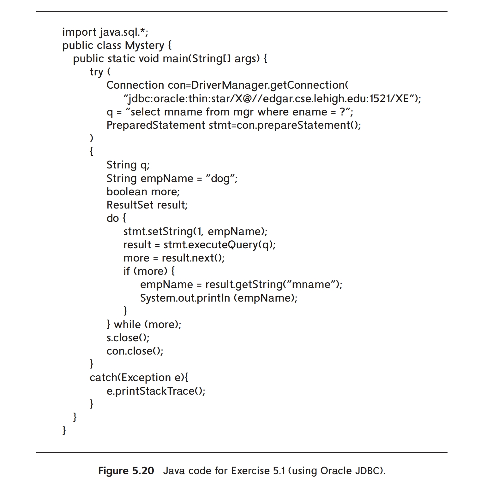
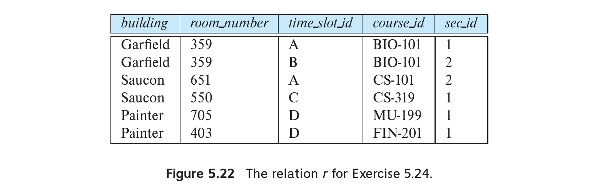

# Exercises 5

## Problem 1

### Problem Description

Consider the following relations for a company database:

- $emp(ename,dname,salary)$
- $mgr(ename,mname)$

and the Java code in Figure 5.20, which uses the JDBC API. Assume that the userid, password, machine name, etc. are all okay. Describe in concise English what the Java program does. (That is, produce an English sentence like “It finds the manager of the toy department,” not a line-by-line description of what each Java statement does.)



### Solution

Find all direct or indirect manager of an employee “dog”.

## Problem 4

### Problem Description

Describe the circumstances in which you would choose to use embedded SQL rather than SQL alone or only a general-purpose programming language.

### Solution

When I want both the convenient of using a SQL to query and the functionality of a programming language (which could not be replaced by SQL statement solely).

## Problem 13

### Problem Description

Suppose you were asked to define a class `MetaDisplay` in Java, containing a method `static void printTable(String r)`; the method takes a relation name $r$ as input, executes the query “`select * from r`,” and prints the result out in tabular format, with the attribute names displayed in the header of the table.

a. What do you need to know about relation $r$ to be able to print the result in the specified tabular format?

b. What JDBC method(s) can get you the required information?

c. Write the method `printTable(String r)` using the JDBC API.

### Solution

#### a

We need to know about the information about $r$’s attributes, including their name and number.

#### b

Methods `getColumnCount()` and `getColumnName(int position)`.

#### c

==The question is open so we don’t provide a fixed answer==.

## Problem 14

### Problem Description

Repeat Exercise 5.13 using ODBC, defining `void printTable(char *r)` as a function instead of a method.

### Solution

#### a

We need to know about the information about $r$’s attributes, including their name and number.

#### b

We can apply `SQLColAttribute(hstmt, &numColumn)` and `SQLColAttribute()`.

#### c

==The question is open so we don’t provide a fixed answer==.

## Problem 19

### Problem Description

Suppose there are two relations $r$ and $s$, such that the foreign key $B$ of $r$ references the primary key $A$ of $s$. Describe how the trigger mechanism can be used to implement the **on delete cascade** option when a tuple is deleted from $s$.

### Solution

Use a trigger to check whenever there’s a delete on $s$, and delete all the tuples in $r$ whose foreign key references $s$.

## Problem 20

### Problem Description

The execution of a trigger can cause another action to be triggered. Most database systems place a limit on how deep the nesting can be. Explain why they might place such a limit.

### Solution

Because there’s possibility for triggers to be triggered in a cyclic form. And thus may lead to infinite nesting and crush the system. On the other hand, we can’t easily prohibit user from writing such a trigger, so the method is used.

## Problem 24

### Problem Description

Consider the relation, $r$, shown in Figure 5.22. Give the result of the following query:

```sql
select building, room_number, time_slot_id, count(*)
from r
group by rollup (building, room_number, time_slot_id)
```



### Solution

As follow:

| $building$ | $room_{-}number$ | $time_{-}slot_{-}id$ | $count$ |
| ---------- | ---------------- | -------------------- | ------- |
| Garfield   | 359              | A                    | 1       |
| Garfield   | 359              | B                    | 1       |
| Saucon     | 651              | A                    | 1       |
| Saucon     | 550              | C                    | 1       |
| Painter    | 705              | D                    | 1       |
| Painter    | 403              | D                    | 1       |
| Garfield   | 359              | null                 | 2       |
| Saucon     | 651              | null                 | 1       |
| Saucon     | 550              | null                 | 1       |
| Painter    | 705              | null                 | 1       |
| Painter    | 403              | null                 | 1       |
| Garfield   | null             | null                 | 2       |
| Saucon     | null             | null                 | 2       |
| Painter    | null             | null                 | 2       |
| null       | null             | null                 | 6       |

