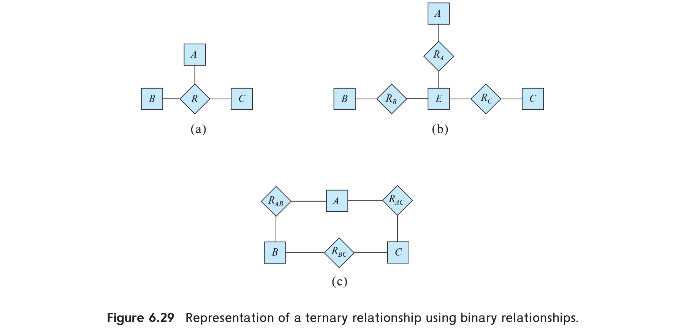
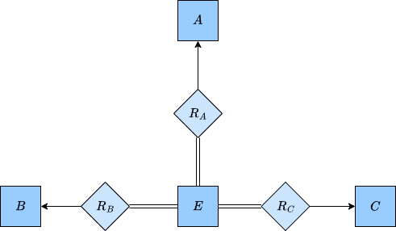

# Exercises 6

## Problem 4

### Problem Description

Consider an E-R diagram in which the same entity set appears several times, with its attributes repeated in more than one occurence. Why is allowing this redundancy a bad practice that one should avoid?

### Solution

For the first reason, such a repetition will bring complexity to E-R diagram. And the second reason is by doing so, we must be careful to maintain consistency among different occurences between the same relation to avoid ambiguous expression.

## Problem 5

### Problem Description

An E-R diagram can be viewed as a graph. What do the following mean in terms of the structure of an enterprise schema?

a. The graph is disconnected.

b. The graph has a cycle.

### Solution

#### a

A disconnected graph means the entity in each connected component is related, however unrelated among different components.

#### b

A cycle in graph simply means there’s more than one path from some entity in the cycle to another entity in the cycle.

## Problem 6

### Problem Description

Consider the representation of the ternary relationship of Figure 6.29a using the binary relationships illustrated in Figure 6.29b (attributes not shown).

a. Show a simple instance of $E,A,B,C,R_A,R_B$, and $R_C$ that cannot correspond to any instance of $A,B,C,$ and $R$.

b. Modify the E-R diagram of Figure 6.29b to introduce constraints that will guarantee that any instance of $E,A,B,C,R_A,R_B,$ and $R_C$ that satisfies the constraints will correspond to an instance of $A,B,C,$ and $R$.

c. Modify the preceding translation to handle total participation constraints on the ternary relationship.

### Solution

#### a

==The question is open so we don’t provide a fixed answer==.

#### b

The E-R diagram is shown as the right figure:

#### c

Suppose the total participation constraint is applied on $A$, then just add such a total participation constraint between $A$ and $R_A$. For $B$ and $C$, the modification is similar.

## Problem 7

### Problem Description

A weak entity set can always be made into a strong entity set by adding to its attributes the primary-key attributes of its identifying entity set. Outline what sort of redundancy will result if we do so.

### Solution

After adding the primary-key attribute of its identifying entity set, those attributes will appear in the strong entity set transformed from the weak entity set, the identifying entity set and the relationship set.

## Problem 8

### Problem Description

Consider a relation such as $sec_{-}course$, generated from a many-to-one relationship set $sec_{-}course$. Do the primary and foreign key constraints created on the relation enforce the many-to-one cardinality constraint? Explain why.

### Solution

Yes. The tuples in $sec_{-}course$ will take use of primary-key attributes of two related relation, and the foreign key constraint will further ensure the existence of certain tuples in the two related relation. Thus the many-to-one cardinality constraint will naturally be guaranteed by the original many-to-one relationship set.

## Problem 9

### Problem Description

Suppose the *advisor* relationship set were one-to-one. What extra constraints are required on the relation *advisor* to ensure that the one-to-one cardinality constraint is enforced?

### Solution

The primary-key attributes of each related relations should be a super key of the relationship relation.

## Problem 10

### Problem Description

Consider a many-to-one relationship $R$ between entity sets $A$ and $B$. Suppose the relation created from $R$ is combined with the relation created from $A$. In SQL, attributes participating in a foreign key constraint  can be null. Explain how a constraint on total participation of $A$ in $R$ can be enforced using **not null** constraints in SQL.

### Solution

Apply **not null** constraint on primary-key attributes of $B$ in $R$.
